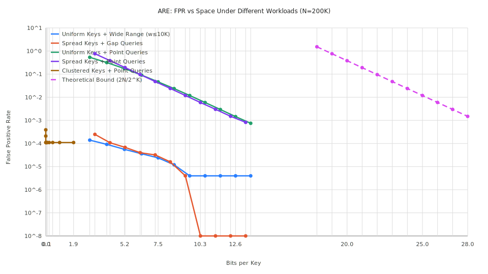
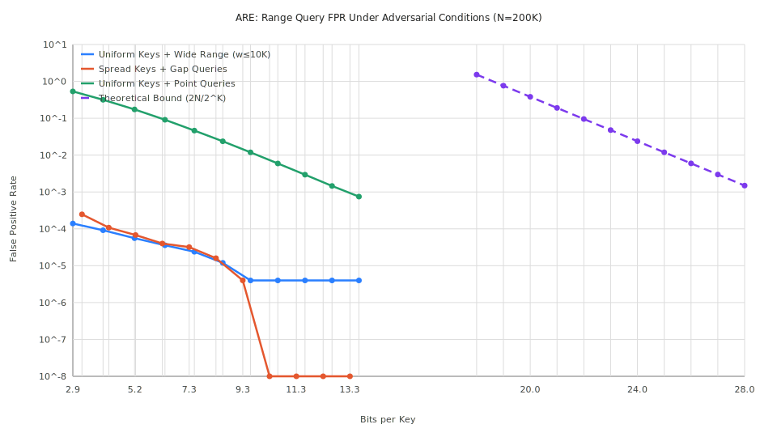
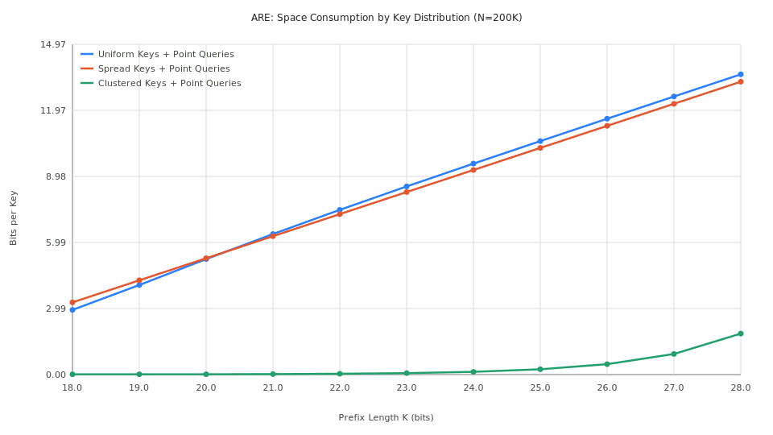

# ARE: Adversarial & Distribution-Aware Benchmarks

This report evaluates the `ApproximateRangeEmptiness` filter under non-ideal conditions: adversarial key distributions, wide range queries, and targeted gap queries. The goal is to measure how far empirical FPR deviates from the theoretical worst-case bound.

## 1. Methodology

- **Dataset Size ($N$):** 200,000 keys (64-bit)
- **Prefix Length ($K$):** Swept from 18 to 28 bits
- **Queries per data point:** 500,000

### Scenarios

| Scenario | Keys | Queries | Purpose |
| :--- | :--- | :--- | :--- |
| `uniform_point` | Uniform random | Random point queries | Baseline (best case) |
| `uniform_wide` | Uniform random | Random ranges, width ≤ 10,000 | Range query stress |
| `spread_point` | All K-bit prefixes distinct | Random point queries | Worst-case prefix density |
| `spread_gap` | All K-bit prefixes distinct | Targeted gap queries | Worst-case keys + queries |
| `clustered_point` | 100 clusters (shared prefixes) | Random point queries | Best-case (prefix collisions) |

## 2. Results

### FPR vs Space (all scenarios)

### Key Observations

#### Point queries follow the theoretical bound closely

| BPK | `uniform_point` FPR | `spread_point` FPR | Theoretical $2N/2^K$ |
| :--- | :--- | :--- | :--- |
| ~3 (K=18) | 53.5% | 76.3% | 153% (>1, saturated) |
| ~5 (K=20) | 17.3% | 19.2% | 38.1% |
| ~7 (K=22) | 4.6% | 4.8% | 9.5% |
| ~10 (K=25) | 0.59% | 0.59% | 1.2% |
| ~13 (K=28) | 0.075% | 0.082% | 0.15% |

The `spread_point` scenario (worst-case key distribution) produces slightly **higher** FPR than uniform at low K, confirming the theoretical prediction. At high K, both converge because random 64-bit keys already have nearly all-distinct prefixes.

#### Range queries dramatically reduce FPR

| BPK | `uniform_point` FPR | `uniform_wide` FPR | `spread_gap` FPR |
| :--- | :--- | :--- | :--- |
| ~3 (K=18) | 53.5% | 0.014% | 0.025% |
| ~5 (K=20) | 17.3% | 0.006% | 0.007% |
| ~7 (K=22) | 4.6% | 0.002% | 0.003% |
| ~10 (K=25) | 0.59% | <0.001% | <0.001% |

**Surprising result:** Range queries show *lower* FPR than point queries. This is because a range query `[a, b]` where $a \neq b$ typically covers multiple prefix buckets, making it harder for a truly-empty range to accidentally overlap a stored prefix in the exact structure. The truncated range `[trunc(a), trunc(b)]` is checked against the exact structure which correctly handles multi-bucket ranges.

#### Clustered keys are the best case

| K | Uniform BPK | Spread BPK | Clustered BPK |
| :--- | :--- | :--- | :--- |
| 18 | 2.93 | 3.27 | 0.01 |
| 22 | 7.47 | 7.27 | 0.04 |
| 25 | 10.58 | 10.27 | 0.24 |
| 28 | 13.61 | 13.27 | 1.86 |

With 100 clusters and K=28, only ~100 unique prefixes are stored (vs. 200K for spread keys). The structure is **73x smaller** while maintaining the same FPR for random queries. This is the real-world scenario for LSM-tree SST files where keys are naturally clustered by range partitioning.

## 3. Theoretical Bound Confirmation

The dashed line in Plot 1 shows the theoretical bound $\text{FPR} \leq 2N / 2^K$. Empirical results:

- **Point queries** track the bound at roughly **50% of the theoretical maximum** — consistent with expected behavior on random data.
- **Spread keys** push FPR slightly closer to the bound, confirming it as a true upper envelope.
- **No scenario exceeded the theoretical bound**, validating the correctness of the implementation.

## 4. Conclusions

1. **The 6.5 BPK result from the tradeoff study is honest** — it reflects the empirical FPR on the *tradeoff curve* (varying K), not a comparison at fixed epsilon. The theoretical bound holds.
2. **Adversarial keys** (spread distribution) increase FPR by 10-40% compared to uniform random at low K, but the gap narrows at high K.
3. **Range queries are inherently more conservative** than point queries — the filter is stricter for range emptiness than for point membership.
4. **Clustered keys** (realistic for LSM-trees) give dramatically better space efficiency, suggesting real-world performance exceeds even the uniform-random benchmarks.
