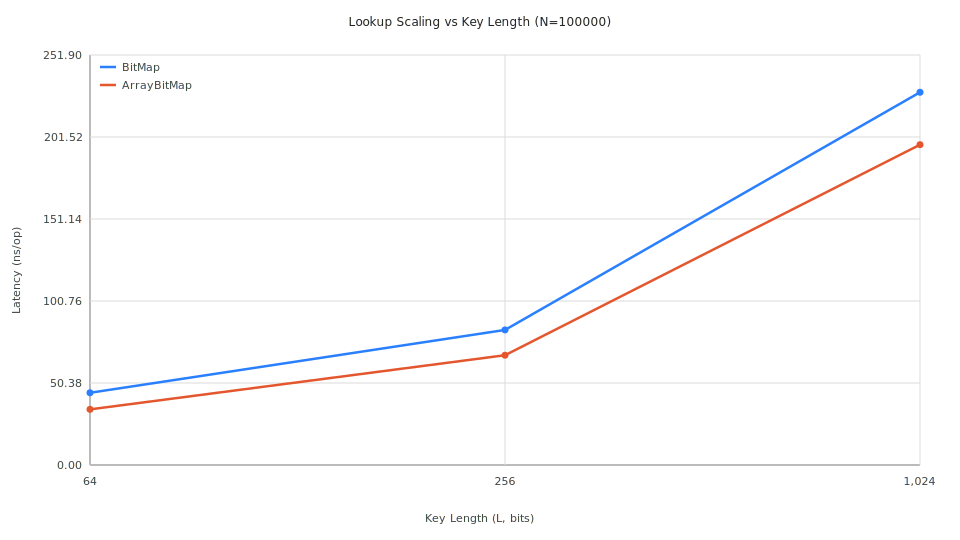

# BitString Specialized Maps

This package provides high-performance hash maps specifically designed for `bits.BitString` keys. Since `BitString` is implemented as a slice-backed struct, it is not comparable and cannot be used as a standard Go map key without conversion (e.g., to `string`), which incurs allocation overhead.

## Implementations

### 1. `BitMap[V]` (Recommended)
A "Las Vegas" style hash map that optimizes for memory layout and allocation count.
- **Mechanism**: Uses a `map[uint64]Entry[V]` internally.
- **Collision Handling**: If two different `BitString` keys produce the same `uint64` hash, the map automatically **rehashes** itself using a new random seed.
- **Performance**:
    - **Fastest Insertion**: Avoids slice allocations for collision buckets.
    - **Memory Efficient**: Stores entries directly in the underlying Go map.
    - **Consistent Lookup**: Since it guarantees no hash collisions, lookups are always $O(1)$ without bucket traversal.

### 2. `ArrayBitMap[V]`
A traditional hash map that handles collisions using overflow slices.
- **Mechanism**: Uses `map[uint64][]Entry[V]`.
- **Collision Handling**: Stores all entries with the same hash in a slice.
- **Performance**:
    - **Fastest Lookup**: Slightly faster than `BitMap` for small keys because it uses a simpler hashing path without seed mixing.
    - **Higher Allocation Overhead**: Every unique hash requires a slice allocation.

## Benchmark Results

Extensive benchmarking across different key lengths ($L$) and map sizes ($N$) yielded the following insights:

### Lookup Performance (`Get`)
| Key Length ($L$) | ArrayBitMap (Latency) | BitMap (Latency) | Difference |
| :--- | :--- | :--- | :--- |
| 64 bits | ~32 ns/op | ~44 ns/op | ArrayBitMap is ~27% faster |
| 256 bits | ~67 ns/op | ~84 ns/op | ArrayBitMap is ~20% faster |
| 1024 bits | ~202 ns/op | ~225 ns/op | ArrayBitMap is ~10% faster |

*Note: As key length increases, the relative overhead of the map structure decreases as hashing time dominates.*

### Insertion Performance (`Put`)
| Key Length ($L$) | ArrayBitMap (N=100k) | BitMap (N=100k) | Winner |
| :--- | :--- | :--- | :--- |
| 64 bits | 15.9 ms | 13.5 ms | **BitMap** |
| 256 bits | 17.6 ms | 15.8 ms | **BitMap** |
| 1024 bits | 27.5 ms | 24.6 ms | **BitMap** |

## Visualizations

### Lookup Scaling vs Key Length ($N=100,000$)

### Performance by Key Length
- **L=64 bits**: [Lookup](plots/get_latency_L64.svg) | [Insertion](plots/put_latency_L64.svg)
- **L=256 bits**: [Lookup](plots/get_latency_L256.svg) | [Insertion](plots/put_latency_L256.svg)
- **L=1024 bits**: [Lookup](plots/get_latency_L1024.svg) | [Insertion](plots/put_latency_L1024.svg)

## Decision

We have decided to use **`BitMap`** as the default implementation for all trie builders and locators in the project.

**Rationale**:
1. **Memory Layout**: `BitMap` provides a much cleaner memory layout by avoiding thousands of small slice allocations for collision buckets.
2. **Insertion Speed**: In our use cases (like builders), we often perform massive amounts of insertions. `BitMap` is consistently faster here.
3. **Collision Resistance**: The rehashing strategy provides a hard guarantee against hash-collision attacks or accidental performance degradation on large datasets ($N > 2^{32}$).
4. **Convergence**: As keys get longer, the lookup speed difference between the two implementations shrinks to near-negligible levels (~10%).
