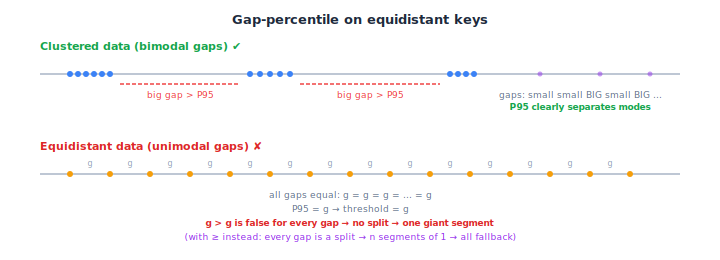

# ARE — Hybrid (Gap-Percentile)

Splits keys into dense clusters and sparse remainder using **gap-percentile segmentation**:
large gaps between sorted keys mark cluster boundaries.
Clusters get [adaptive ARE](../are_adaptive/) (exact mode when possible).
Remainder gets [truncation ARE](../are_trunc/).

The idea is the same as [`are_hybrid_scan`](../are_hybrid_scan/) — isolate dense regions
to exploit exact mode — but with a simpler, purely gap-based detector.

## Core Idea: Split at Large Gaps

Given $n$ sorted keys, compute gaps $g_i = key_{i+1} - key_i$.
The 95th-percentile gap (via [quickselect](https://en.wikipedia.org/wiki/Quickselect))
becomes the threshold $\tau$. Then:

1. **Split** at every position where $g_i > \tau$.
2. **Filter**: segments with $\geq 1\%$ of $n$ keys become clusters.
3. **Fallback**: remaining keys go to [truncation ARE](../are_trunc/).

Each cluster is built as an [adaptive ARE](../are_adaptive/) — if the cluster's spread
fits in $K$ bits, exact mode triggers (FPR = 0, no hash). Otherwise SODA mode.

This works well when the data has a clear bimodal gap distribution: small intra-cluster
gaps and large inter-cluster gaps. The P95 threshold naturally falls between the two modes.

## Limitations

### Equidistant Data

When all gaps are equal (sequential keys, arithmetic progressions), the gap distribution
has a single mode — there is no "large gap" to split at.



- P95 $= g$ (the common gap) $\Rightarrow$ threshold $\tau = g$
- Strict inequality $g_i > \tau$ fails for all gaps $\Rightarrow$ one giant segment
  (which is correct — sequential data *is* one cluster)
- But if $g_i \geq \tau$ were used instead: every gap is a boundary $\Rightarrow$ $n$
  segments of size 1, all below `minClusterFrac` $\Rightarrow$ everything goes to
  fallback $\Rightarrow$ trunc on dense data $\Rightarrow$ FPR catastrophe

The strict `>` fix works for pure sequential data but is fragile: any slight variation
in gaps (e.g. sequential + a few outliers) can flip the behavior unpredictably.

### No Merging of Adjacent Segments

The algorithm splits at every large gap independently. Two adjacent small segments
that together would form a valid cluster are never merged:

```
 Segment A (0.8% of n)    Segment B (0.7% of n)
 ├────────────┤  big gap  ├───────────┤
 < minClusterFrac         < minClusterFrac
 → both go to fallback    → both go to fallback

 Together: 1.5% of n — would qualify as a cluster
```

### Fallback is Always Trunc

Unlike [`are_hybrid_scan`](../are_hybrid_scan/) which chooses between truncation and SODA
based on a safety check, this implementation always falls back to truncation.
If the fallback keys have small gaps relative to the phantom size
($\text{spread} / 2^K$), truncation produces high FPR.

## When It Works Well

- **Clearly clustered data** with wide gaps between clusters (SOSD Facebook, Books)
- **Uniform random data** with no clusters — everything goes to trunc, which handles
  uniform data optimally (BPK $= \log_2(1/\varepsilon)$, saving $\log_2(\mathcal{L})$)
- **Low $n$** where the gap distribution is less noisy

## Parameters

| Parameter | Value | Role |
|---|---|---|
| `gapPercentile` | 0.95 | Use P95 gap as split threshold |
| `minClusterFrac` | 0.01 | Segments with $< 1\%$ of keys go to fallback |

Both are hardcoded — not derived from problem parameters ($\mathcal{L}$, $\varepsilon$),
unlike [`are_hybrid_scan`](../are_hybrid_scan/) which derives eps from $\mathcal{L}/\varepsilon$.

## See Also

- [`are_hybrid_scan`](../are_hybrid_scan/) — addresses the limitations above with
  [1D DBSCAN](https://en.wikipedia.org/wiki/DBSCAN), parameter-derived eps, segment merging,
  and dual fallback (trunc/SODA).
