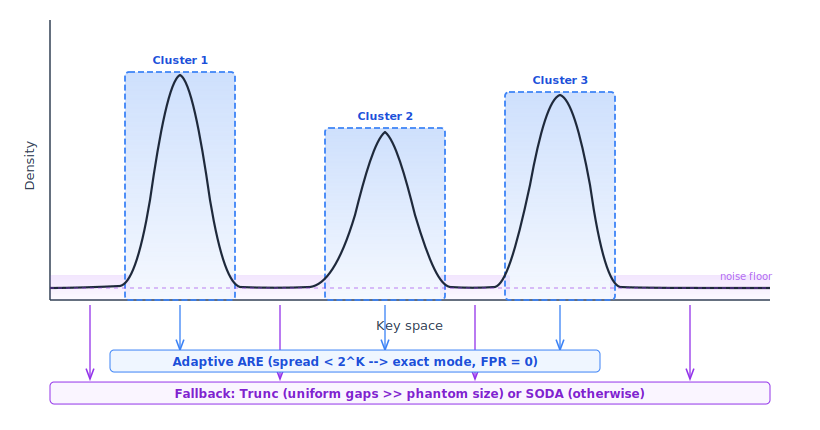
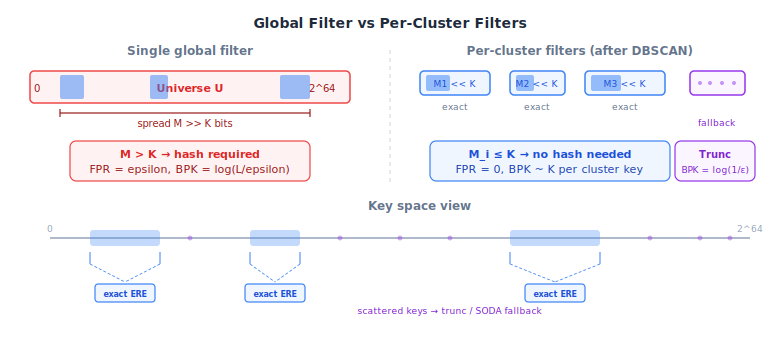

# ARE — Hybrid Scan (DBSCAN)

Splits keys into dense clusters ([1D DBSCAN](https://en.wikipedia.org/wiki/DBSCAN)) and sparse remainder.
Clusters get [adaptive ARE](../are_adaptive/) (exact mode, FPR=0). Remainder gets
[truncation](../are_trunc/) or [SODA](../are_soda_hash/), depending on safety.

## Core Idea: Density-Based Segmentation

From the [adaptive filter analysis](../are_adaptive/README.md#when-does-exact-mode-trigger):
exact mode (FPR=0, no hash) triggers when spread $< 2^K$, i.e. density
$\rho > \varepsilon / \mathcal{L}$. The threshold is extremely low — almost any
real-world cluster passes it.

The task: find such clusters automatically, separating them from scattered noise.

### Why Clusters Compress So Well

Real-world key distributions concentrate most keys into a few tight regions.
In practice "tight" means many keys share a long common prefix — they differ only
in the last few bits. Examples:

- **URLs:** `https://example.com/user/1001`, `https://example.com/user/1002`, … —
  the first 30+ characters are identical.
- **File paths:** `/var/log/nginx/access.2026-03-15.log`, `/var/log/nginx/access.2026-03-16.log`
- **Timestamps:** `1742140800`, `1742140801`, `1742140802`, … —
  events within the same second share all but the lowest bits.
- **Geo-coordinates** ([S2 cell IDs](http://s2geometry.io/)):
  `3854197031493271552`, `3854197031493271553` — nearby points on a map share
  a long prefix encoding their containing cell.

Each such cluster occupies a tiny fraction of the full 64-bit key space — its spread
$M_{\text{cluster}}$ is far smaller than the global spread $M$.

When a cluster is isolated into its own sub-filter, the [adaptive ARE](../are_adaptive/)
sees only the local spread. Since $M_{\text{cluster}} \ll 2^K$, exact mode triggers:
no hash needed, FPR = 0, and the universe size shrinks to fit just the cluster's range.
The tighter the cluster, the smaller its universe — and the fewer bits the
[ERE](../ere/) trie needs to represent it.

This is the central advantage over a single global filter: instead of one universe
spanning the entire key space (where $M > K$ forces hashing and nonzero FPR), we get
many small exact universes — each with zero false positives.

### Why Not Gap-Percentile?

[`are_hybrid`](../are_hybrid/) uses the P95 gap as a split threshold. Known problems:

- **Equidistant data** (sequential keys): all gaps equal $\Rightarrow$ P95 = same gap
  $\Rightarrow$ either 0 segments or $n$ segments.
- **No merging**: two adjacent small segments are never joined into one cluster.

### 1D DBSCAN in O(n)

[DBSCAN](https://en.wikipedia.org/wiki/DBSCAN) is normally $O(n^2)$ due to neighbor search.
On sorted 1D data, the $\varepsilon$-neighborhood of any point is a contiguous range — so
the entire algorithm reduces to two-pointer sweeps:

1. **Forward sweep:** for each `key[i]`, advance the left pointer while
   `key[i] - key[left] > eps`. If the window has $\geq$ `minPts` points $\Rightarrow$
   `key[i]` is a core point.
2. **Reverse sweep:** same logic right-to-left (forward pass only marks the rightmost
   points of each dense window).
3. **Core runs:** contiguous core points with gap $\leq$ eps form cluster cores.
4. **Merge:** adjacent cores within eps of each other are joined — this naturally
   merges nearby dense regions that gap-based methods would keep separate.
5. **Border expansion:** non-core points within eps of a core join the nearest cluster.
6. **Post-filter:** clusters with fewer than `minClusterSize` keys dissolve back to fallback.

Two separate parameters (unlike classic DBSCAN which conflates them):

| Parameter        | Value | Role                                                                          |
|------------------|-------|-------------------------------------------------------------------------------|
| `minPts`         | 10    | DBSCAN core threshold — "a point is dense if it has 10+ neighbors within eps" |
| `minClusterSize` | 256   | Post-filter — clusters below this size aren't worth the metadata overhead     |

## Choosing eps: From Problem Parameters, Not Data

$$\text{eps} = c \cdot \frac{\mathcal{L}}{\varepsilon}, \quad c = 10$$

From the [exact mode analysis](../are_adaptive/README.md#when-does-exact-mode-trigger):
exact mode triggers when average gap $< \mathcal{L}/\varepsilon$.
So $\text{eps} = 10 \cdot \mathcal{L}/\varepsilon$ means:
*regions 10$\times$ denser than the exact-mode threshold get clustered.*

Sanity check ($\mathcal{L}=128$, $\varepsilon=10^{-3}$, eps $= 1.28 \times 10^6$):

| Distribution                           | Typical gap    | Gap vs eps | Result          |
|----------------------------------------|----------------|------------|-----------------|
| Cluster (internal gap $\sim$100)       | 100            | $\ll$ eps  | Cluster found   |
| Uniform 64-bit (avg gap $\sim 2^{44}$) | $\sim 10^{13}$ | $\gg$ eps  | All fallback    |
| Sequential (gap=1000)                  | 1000           | $\ll$ eps  | One big cluster |

No data statistics, no percentiles. Pure derivation from $\mathcal{L}$ and $\varepsilon$.

## Dual Fallback: Trunc When Safe, SODA When Not

Keys not assigned to any cluster go to a fallback filter. But which one?

- [**Truncation**](../are_trunc/) saves $\log_2(\mathcal{L})$ BPK, but
  [breaks when](../are_trunc/README.md#the-price-of-contiguity) min gap $<$ phantom size
  $= \text{spread} / 2^K$.
- [**SODA**](../are_soda_hash/) works on any distribution, but costs $\log_2(\mathcal{L})$
  extra BPK.

After DBSCAN separates clusters from fallback, we check the fallback keys:

$$\text{phantom_size} = \frac{\text{spread}_{\text{fallback}}}{2^K}$$

- Compute the 5th-percentile gap ($P_5$) via [quickselect](https://en.wikipedia.org/wiki/Quickselect) — a robust min-gap
  estimate.
- $P_5 > \text{phantom_size}$ $\Rightarrow$ **truncation** (safe, saves bits)
- $P_5 \leq \text{phantom_size}$ $\Rightarrow$ **adaptive/SODA** (guaranteed FPR)

No chicken-and-egg: we already know which keys are in fallback before choosing the mode.

## Query: O(log C) + Sub-Filter

Clusters are sorted by `[minKey, maxKey]`. For a query $[a, b]$:

1. [Binary search](https://en.wikipedia.org/wiki/Binary_search) over clusters intersecting $[a, b]$
2. Check each intersecting cluster (typically 0--1)
3. Check fallback filter
4. Return "empty" only if **all** sub-filters agree

## FPR Guarantee

Each sub-filter independently targets FPR $\leq \varepsilon$:

- Cluster filters: [adaptive ARE](../are_adaptive/) — exact mode (FPR=0) or SODA (FPR $\leq \varepsilon$)
- Fallback trunc: bounded when `truncSafe` = true
- Fallback adaptive: SODA guarantee (FPR $\leq \varepsilon$)

Overall FPR $\leq \varepsilon \times$ (number of sub-filters queried per query), typically 1--2.
