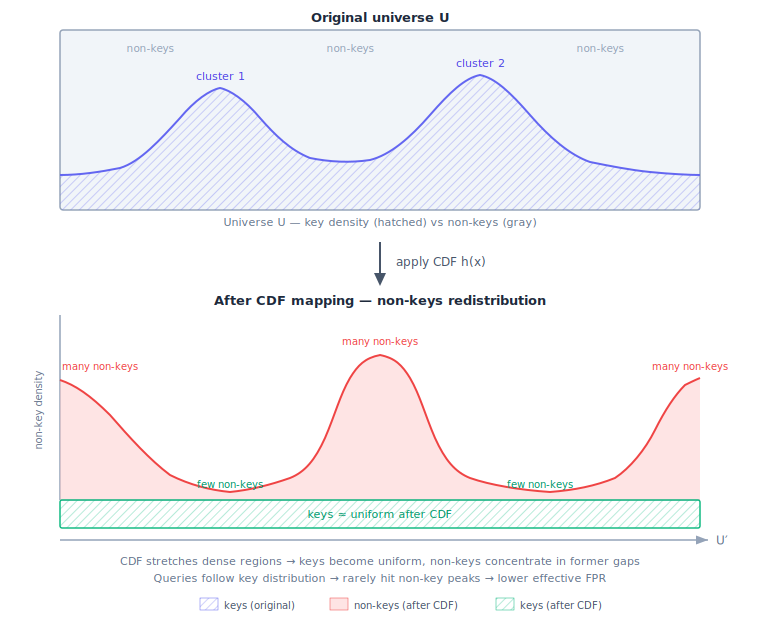

# ARE — CDF Mapping (PGM Index)

An experimental approach: use the empirical CDF of the data as the locality-preserving
hash $h$, redistributing the FPR budget from sparse regions (where queries are rare)
to dense regions (where queries concentrate).

**Status:** theoretical exploration. Benchmarks did not show practical improvement
over [SODA](../are_soda_hash/) or [Hybrid Scan](../are_hybrid_scan/).

## Motivation: Beating the Lower Bound?

The [information-theoretic lower bound](../README.md#asymptotics-see-paper) says
any ARE structure needs at least $n \log_2(\mathcal{L}/\varepsilon)$ bits. This holds
for **all** data and query distributions — it cannot be improved in the general case.

But what if we don't need to handle all distributions?

**Assumption:** in practice, queries follow approximately the same distribution as stored
keys. Users query ranges where data exists, not empty regions of the key space.

Under this assumption, FPR in sparse regions (inter-cluster gaps) doesn't matter —
queries rarely land there. If we could **move** FPR budget away from dense regions
(where queries concentrate) and into sparse regions (where queries don't go), the
effective FPR experienced by real queries would be lower for the same number of bits.

## Core Idea: CDF as a Hash Function

**Top panel:** the original universe $U$. Keys follow some non-uniform distribution
(uniform background + two clusters). The gray area above the density curve represents
non-keys — points that can cause false positives.

**After CDF mapping:** the CDF is a monotonic function that maps keys to a near-uniform
distribution. This stretches dense regions (clusters) and compresses sparse regions (gaps):

- **Where keys were dense** (clusters): the mapped space is stretched, so the same number
  of non-keys is spread over a wider interval → fewer non-keys per unit length → lower
  local FPR.
- **Where keys were sparse** (gaps): the mapped space is compressed, non-keys pile up →
  higher local FPR. But under our assumption, queries rarely land here.

**Bottom panel:** keys are now approximately uniform in the mapped universe $U'$.
The non-key density curve is the inverse of the original PDF — valleys where clusters
were (few non-keys = low FPR), peaks where gaps were (many non-keys = high FPR).

### Why This Reduces FPR

As we write in the [parent README](../README.md#the-role-of-the-hash-function):
> The ideal hash would map $S'$ and $Y'$ to completely disjoint regions of $U'$ — zero overlap, zero false positives.

A false positive occurs when a non-key (gray point on the top panel) gets mapped
to the same position as a real key in the compressed universe $U'$. The CDF
compresses sparse regions — so non-keys from the gaps get squeezed together into
narrow "pillars" in the mapped space.

The intuition: in dense regions (where most queries land), there are fewer non-keys
per unit of mapped space after stretching, so fewer candidates for collision with
stored keys. Conversely, non-keys from gaps pile up in the compressed regions —
but queries rarely land there.

**Caveat:** this argument is informal. Because the CDF maps everything monotonically,
keys and non-keys are still interleaved in $U'$ — there is no strict separation.
The FPR reduction depends on the query distribution matching the data distribution
and is not formally bounded (see [Limitations](#limitations)).

The CDF is monotonic by construction: $x_1 < x_2 \Rightarrow h(x_1) \leq h(x_2)$,
so range queries are preserved — **zero false negatives** guaranteed.

## Implementation

1. **Sort** input keys.
2. **Build PGM index** ([agnivade/pgm](https://github.com/agnivade/pgm)) on float64-converted
   keys to get an approximate CDF.
3. **Fix monotonicity** — PGM positions may be non-monotone due to float64 rounding;
   enforce via running max.
4. **Sample CDF control points** every `pgmEpsilon` keys → piecewise-linear model.
5. **Compute $L_\text{eff}$** — the effective range length after CDF distortion.
   A query of length $\mathcal{L}$ in the original space maps to a range of variable
   width in $U'$, depending on the local CDF slope. In the worst case (densest CDF
   segment), the mapped range is longest:
   $L_\text{eff} = \mathcal{L} \times \max_\text{segment} \text{density}$, where
   density = $\Delta\text{rank} / \Delta\text{key} \times n$ (local slope of the CDF
   scaled by $n$). We use the maximum over all segments to guarantee $K$ is sufficient
   everywhere.
6. **Set $K$** $= \lceil \log_2(n \cdot L_\text{eff} / \varepsilon) \rceil$.
7. **Map keys** through piecewise-linear CDF → deduplicate → build [ERE](../ere/).
8. **Query:** map both endpoints through the same CDF, forward to ERE.

CDF model cost: each control point stores `(uint64 key, float64 rank)` = 128 bits.
For `pgmEpsilon=128`: $\approx n/128$ points $\approx 1$ bit per key.

### Smoothing

Pure CDF compresses gaps to near-zero mapped resolution → FPR ≈ 100% in gap regions.
An optional smoothing parameter $\alpha$ blends CDF with uniform mapping:

$$h(x) = (1 - \alpha) \cdot \text{CDF}(x) + \alpha \cdot \text{uniform}(x)$$

- $\alpha = 0$: pure CDF (default)
- $\alpha = 0.01 \text{–} 0.1$: mostly CDF, gaps retain some resolution
- $\alpha = 1$: pure uniform (no CDF benefit)

In practice, smoothing only helps when query distribution is wider than data distribution
($\sigma_\text{query} > \sigma_\text{data}$), which contradicts our core assumption.

## Limitations

- **O(n²) build time** due to PGM convex hull construction. Constructor returns error
  for $n > 2^{20}$.
- **float64 precision loss** for keys $> 2^{53}$ (PGM operates on float64 internally).
- **FPR is not formally bounded** — depends on how well the query distribution matches
  the data distribution. If queries are uniform but data is clustered, FPR degrades
  severely.
- **CDF model overhead** adds 1–2 BPK on top of ERE storage.

## Experimental Results

Benchmarks against [SODA](../are_soda_hash/) showed that CDF-ARE does not provide
a consistent practical advantage. Key findings (see [ANALYSIS.md](ANALYSIS.md)):

- When query distribution matches data: CDF-ARE uses fewer bits per key, but FPR
  is comparable or worse due to $L_\text{eff}$ amplification in dense regions.
- When query distribution diverges from data: FPR degrades catastrophically
  (40–58% at $\sigma_\text{query} = 4 \times \sigma_\text{data}$).
- The O(n²) build cost makes it impractical for large datasets.
- [Hybrid Scan](../are_hybrid_scan/) achieves a similar goal (exploit clustering)
  more effectively via segmentation + exact mode, without the CDF overhead.

## Future Work

- More efficient CDF construction (avoid O(n²) PGM hull)
- Formal FPR bounds under distributional assumptions
- Adaptive CDF granularity (finer in dense regions, coarser in sparse)
- Combination with hybrid segmentation: CDF-ARE per cluster instead of globally
