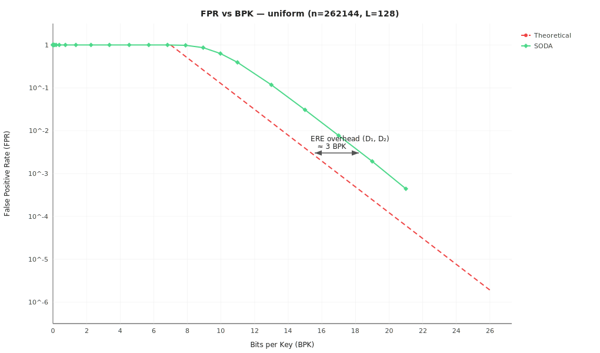
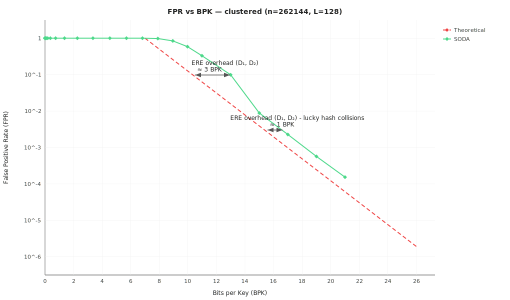

# ARE — SODA 2015 Pairwise-Independent Hash

The paper's original locality-preserving hash ([§3.1](https://arxiv.org/pdf/1407.2907)):

$$h(x) = (u(\lfloor x/r \rfloor) + x) \bmod r, \quad r = 2^K$$

where $u: [U/r] \to [r]$ is drawn from a pairwise independent family.

## Guarantees

This is the baseline construction from the paper. It provides:

- **FPR $\leq \varepsilon$ for any data distribution** — sequential, clustered, adversarial, anything.
  Pairwise independence gives $\Pr[h(x_1) = h(x_2)] \leq 1/r$ regardless of key structure.
- **No false negatives** — $h$ is locality-preserving: $h([a,b])$ is a union of at most 2 intervals in $[r]$.
- **$K = \lceil \log_2(n\mathcal{L}/\varepsilon) \rceil$**, giving **BPK $= \log_2(\mathcal{L}/\varepsilon) + O(1)$** — matching
  the information-theoretic lower bound from [§2](https://arxiv.org/pdf/1407.2907).

## Space Overhead

The hash itself stores only two 64-bit coefficients $(a, b)$ — **$O(1)$ bits**, independent of $n$.

The overhead comes from the ERE layer (see [`ere`](../ere/)): bitvectors $D_1$ ($n$ bits) and $D_2$ ($\sim 2n$ bits)
for block indexing add **$\approx 3$ bits per key** on top of the theoretical minimum.

Total: $\log_2(\mathcal{L}/\varepsilon) + \sim 3$ bits per key.

### Empirical (n=262144, L=128)

SODA tracks the theoretical bound on both distributions. On uniform data the gap is ~3 BPK (ERE overhead from $D_1$, $D_2$). On clustered data it narrows to ~1 BPK: hash collisions within clusters reduce the number of unique fingerprints, making ERE more compact per key.

## Implementation (see [are_soda_hash.go](are_soda_hash.go))

1. Divide $U$ into blocks of size $r = 2^K$.
2. For each block, compute pairwise-independent shift: top $K$ bits of $(a \cdot \text{blockIdx} + b)$.
3. Hash each key: $h(x) = (u(\lfloor x/r \rfloor) + x) \bmod r$.
4. Sort, deduplicate, build ERE over $[0, 2^K)$.
5. Query: hash both endpoints. Cyclic shift may split a range into two intervals — check both.
