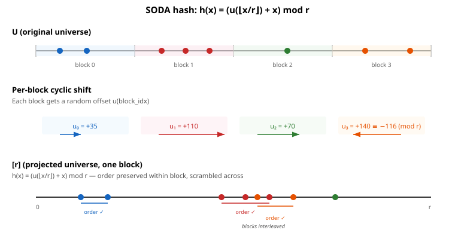
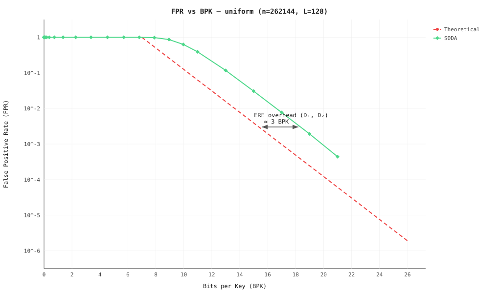
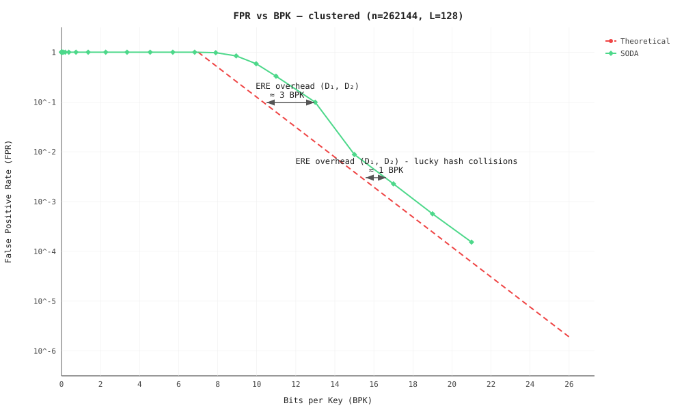

# ARE — SODA 2015 Pairwise-Independent Hash

The paper's original locality-preserving hash ([§3.1](https://arxiv.org/pdf/1407.2907)):

$$h(x) = (u(\lfloor x/r \rfloor) + x) \bmod r, \quad r = 2^K$$

where $u: [U/r] \to [r]$ is drawn from a pairwise independent family.

**Why this works:**
- Within a block: keys keep their relative order (cyclic shift). No information is lost.
- Across blocks: random offsets scramble relative positions. Two keys from different blocks collide with probability exactly $1/r$ — independent of how close they were in $U$.
- FPR guarantee holds for any data distribution (sequential, clustered, adversarial).

## Guarantees

This is the baseline construction from the paper. It provides:

- **FPR $\leq \varepsilon$ for any data distribution** — sequential, clustered, adversarial, anything.
  Pairwise independence gives $\Pr[h(x_1) = h(x_2)] \leq 1/r$ regardless of key structure.
- **Locality-preserving** — $h([a,b])$ is a union of at most 2 intervals in $[r]$.
  Why at most 2: the hash applies a per-block cyclic shift $u(\text{block})$, so consecutive keys
  within the same block map to consecutive positions in $[r]$. A query range $[a, b]$ spans at most
  2 blocks (the one containing $a$ and the one containing $b$), producing at most 2 contiguous
  intervals in the mapped space.
- **Compact** — stores only two 64-bit coefficients $(a, b)$: $O(1)$ bits, independent of $n$.

## Space Overhead

The hash itself stores only two 64-bit coefficients $(a, b)$ — **$O(1)$ bits**, independent of $n$.

The overhead comes from the ERE layer (see [`ere`](../ere/)): bitvectors $D_1$ ($n$ bits) and $D_2$ ($\sim 2n$ bits)
for block indexing add **$\approx 3$ bits per key** on top of the theoretical minimum.

Total: $\log_2(\mathcal{L}/\varepsilon) + \sim 3$ bits per key.

### Empirical (n=262144, L=128)

SODA tracks the theoretical bound on both distributions. On uniform data the gap is ~3 BPK (ERE overhead from $D_1$, $D_2$). On clustered data it narrows to ~1 BPK: hash collisions within clusters reduce the number of unique fingerprints, making ERE more compact per key.

## Note on the small-universe regime (SOSD-Books, Wiki, OSM)

When the actual key universe $U$ is much smaller than the nominal
64-bit type — e.g. SOSD-Books at $n=2^{24}$ has $|U| \approx 4 \cdot 10^7$
($\lceil \log_2 |U| \rceil = 26$ bits) — the construction enters an
implicit *exact-storage* regime once the fingerprint length crosses
the universe width: $K \ge \lceil \log_2 |U| \rceil$.

In this regime every key has the same `blockIdx = 0`, so the per-block
rotation $h(x) = (u(0) + x) \bmod 2^K$ becomes a *bijection* on
$[0, |U|) \subset [0, 2^K)$. Distinct keys map to distinct fingerprints
and a query range $[a, a+\mathcal{L}-1]$ outside $S$ can never collide
with any stored fingerprint — **FPR drops to 0 deterministically**.

Empirically (`bench_results/data/N16777216/sosd_books/L65536.json`):
SODA reaches FPR $= 0$ at $\sim 6.15$ BPK on Books regardless of
$\mathcal{L}$. This sits below the Goswami lower-bound curve drawn
on the FPR-vs-BPK plot, which assumes a worst-case universe with
$|U| \gg n\mathcal{L}/\varepsilon$. The gap is the universe-size
advantage, not a violation of the bound.

### Verifying the effect

A small probe (`/tmp/exact_mode_probe`, not part of the regular
suite) confirms:

| Random 64-bit keys added | universe                 | $K = 28$ BPK | $K = 28$ FPR |
|--------------------------|--------------------------|-------------:|-------------:|
| $0$                      | 26-bit (Books native)    | 6.15         | $0$          |
| $1$                      | 64-bit (one outlier)     | 6.15         | $0$          |
| $100$                    | 64-bit (sparse)          | 6.15         | $0$          |
| $10^4$                   | 64-bit (sparse)          | 6.15         | $3.8 \cdot 10^{-4}$ |
| $10^6$                   | 64-bit (denser)          | 6.11         | $5.9 \cdot 10^{-2}$ |

Two takeaways:

* BPK is essentially constant as we widen the universe: ERE
  storage cost $\approx K - \log_2 n + O(1)$ depends only on $K$
  and $n$, not on $|U|$.
* FPR is what changes. To keep FPR $\le \varepsilon$ on a true
  64-bit-universe distribution, $K$ must grow to
  $\lceil \log_2(n \mathcal{L} / \varepsilon) \rceil$, so the
  Books-only ``$\sim 6$ BPK at FPR $= 0$'' result does not
  generalise to large-universe data — there SODA settles at
  the predicted $\log_2(\mathcal{L}/\varepsilon) + \sim 3$ BPK.

(Candidate appendix material if there is room in the thesis.)

## Implementation (see [are_soda_hash.go](are_soda_hash.go))

1. Divide $U$ into blocks of size $r = 2^K$.
2. For each block, compute pairwise-independent shift: top $K$ bits of $(a \cdot \text{blockIdx} + b)$.
3. Hash each key: $h(x) = (u(\lfloor x/r \rfloor) + x) \bmod r$.
4. Sort, deduplicate, build ERE over $[0, 2^K)$.
5. Query: hash both endpoints. Cyclic shift may split a range into two intervals — check both.
