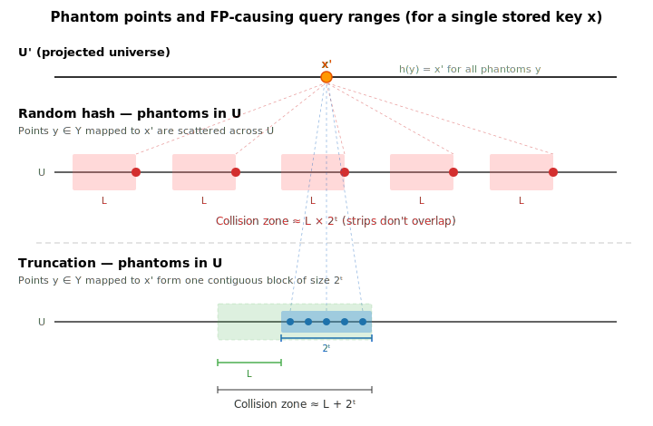
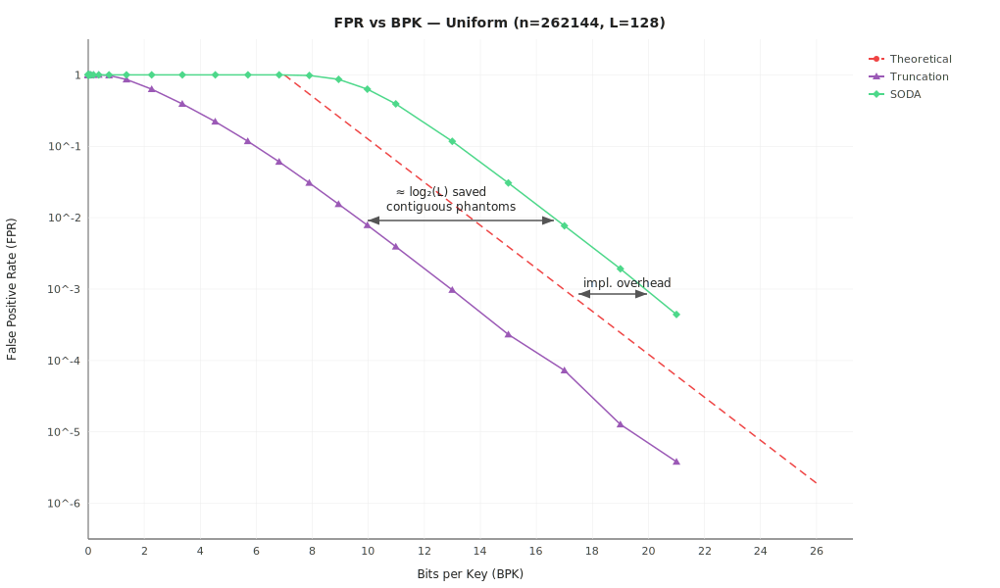

# ARE — Prefix Truncation

Locality-preserving hash via prefix truncation: $h(x) = \lfloor x / 2^t \rfloor$, keeping the top $K = L - t$ bits.

## Core Idea: Contiguous Phantoms

Recall from [the parent README](../README.md): a false positive occurs when a point $y \in Y$ collides with
some $x' \in S'$ under the hash $h$. We call such $y$ **phantom points** of $x$ — points where $h(y) = h(x)$.

With truncation, the $2^t$ phantom points of each stored key $x$ form a **contiguous interval** of length $2^t$ in the
original universe $U$ (all points sharing the same K-bit prefix).

This is the key difference from a random hash:

**Random hash (SODA §3.1):** phantoms of $x$ are scattered uniformly across $U$. A query range of length $\mathcal{L}$
can hit each phantom independently. The number of query positions that overlap with at least one
phantom $\approx \mathcal{L} \times 2^t$.

**Truncation:** phantoms of $x$ are a single contiguous block. A query range of length $\mathcal{L}$ either overlaps
this block or doesn't. The number of query positions that overlap $\approx \mathcal{L} + 2^t$.

Per stored key, the "collision zone" is $\mathcal{L} + 2^t$ instead of $\mathcal{L} \times 2^t$. This eliminates
the $\mathcal{L}$ factor from the space formula:

|             | Collision zone per key   | $K$ for FPR $\leq \varepsilon$     | BPK                                      |
|-------------|--------------------------|------------------------------------|------------------------------------------|
| Random hash | $\mathcal{L} \times 2^t$ | $\log_2(n\mathcal{L}/\varepsilon)$ | $\log_2(\mathcal{L}/\varepsilon) + O(1)$ |
| Truncation  | $\mathcal{L} + 2^t$      | $\log_2(2n/\varepsilon)$           | $\log_2(1/\varepsilon) + O(1)$           |

Truncation saves $\log_2(\mathcal{L})$ bits per key compared to the paper's hash.

### Empirical Confirmation (uniform keys, n=262144)

At $\mathcal{L}=128$, the SODA curve is shifted right by $\approx \log_2(128) = 7$ BPK relative to Truncation — matching the theory. Both track the theoretical bound closely on uniform data.

## Limitation: Data-Dependent FPR

The contiguous-phantom argument assumes keys are **spread** across the universe — so that truncated prefixes uniformly
cover $[0, 2^K)$.

When keys are sequential ($x, x+1, x+2, \ldots$), consecutive keys share the same $K$-bit prefix. The phantom intervals
overlap, the separation between $S'$ and $Y'$ collapses, and FPR can reach 100%.

The SODA hash (see [`are_soda_hash`](../are_soda_hash/)) avoids this via pairwise independence: collision probability is
exactly $1/r$ regardless of key structure, at the cost of $\log_2(\mathcal{L})$ extra bits per key.

## Implementation

1. **Normalize:** subtract $\min(S)$ from all keys, find `spreadStart` — the first significant bit
   of $\max(S) - \min(S)$.
2. **Truncate:** extract $K$ bits starting at `spreadStart` from each shifted key.
3. **Build ERE** over the $K$-bit fingerprints.
4. **Query:** normalize endpoints the same way, forward to ERE.

$K = \lceil \log_2(2n/\varepsilon) \rceil$ (see `NewApproximateRangeEmptiness`).
