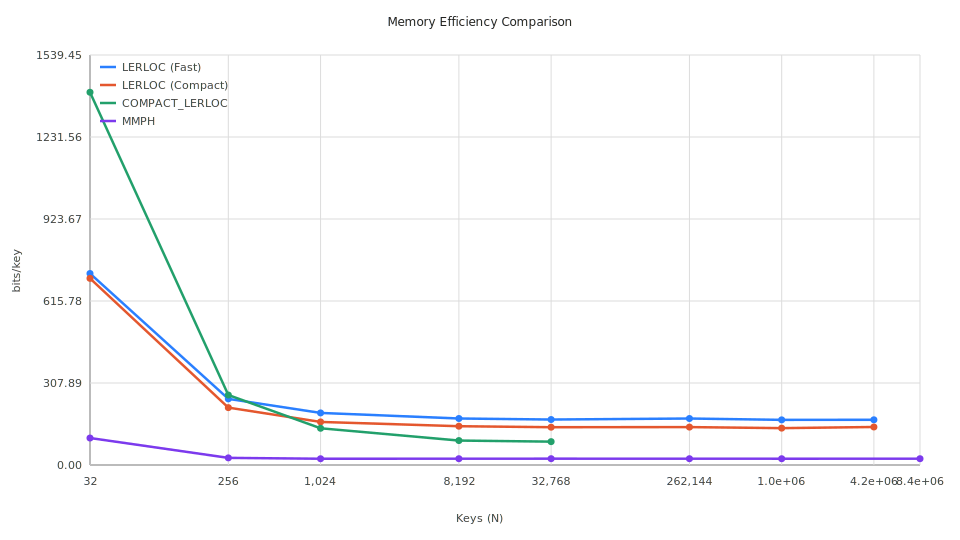

# Locators Module

The `locators` package provides structures for mapping query prefixes to rank intervals $[start, end)$ in a sorted key set. It serves as the bridge between tree-based navigation and index-based data retrieval.

## Sub-modules

- **`locators/rloc`**: Implements the base **Range Locator**. It indexes a boundary set $P$ derived from a trie and uses a Monotone Minimal Perfect Hash (MMPH) to map node names to intervals in $O(1)$ time.
- **`locators/lerloc`**: Implements the **Local Exact Range Locator** (LERLOC). It composes a top-level trie (HZFT) with a Range Locator to support efficient prefix search without storing full keys.

## Features

- **Trie Modes**: Supports two top-level trie implementations:
  - `FastTrie` (Standard HZFT): Optimized for maximum query speed (~64 bits/key for $L=64$).
  - `CompactTrie` (Succinct SHZFT): Optimized for space using $O(N \log \log L)$ scaling (~35 bits/key for $L=64$).
- **Hierarchical Memory Reporting**: All structures implement `MemDetailed()`, providing a recursive breakdown of memory usage (Headers, MPH, Buckets, BitVectors) exportable to JSON.
- **Automated Parameter Selection**: Built-in logic to choose optimal bit-widths for internal types based on dataset size and key length.

## Performance Summary (64-bit keys)

### 1. Memory Efficiency (bits/key)

| Keys (N) | RLOC (Base) | LERLOC (Fast) | LERLOC (Compact) |
|----------|-------------|---------------|------------------|
| 1,024    | 54.04       | 125.4         | 93.4             |
| 32,768   | 52.94       | 117.0         | 91.1             |
| 262,144  | 53.12       | 126.9         | 93.8             |

*Note: Compact mode reduces total memory by ~30% for 64-bit keys compared to Fast mode.*


*Figure 1: Memory efficiency comparison across different modules and modes.*

### 2. Query Latency

- **Fast Mode**: Extremely high performance ($O(1)$ array accesses).
- **Compact Mode**: $\approx 1.4\times$ slower for long keys ($L=1024$) due to Rank operations, but remains on-par for short keys ($L=64$) due to better cache locality.

## Deep Dive Investigations

For detailed analysis of component scaling and memory bottlenecks, see:
- [MMPH & Boundary Set Expansion ($|P|/N \approx 3.3$)](rloc/MEMORY_INVESTIGATION.md)
- [HZFT Algorithm & Pseudo-descriptor Overhead ($O(N \log L)$)](rloc/HZFT_MEMORY_INVESTIGATION.md)
- [SHZFT Design & Succinct Dictionary Research ($O(N \log \log L)$)](rloc/OPTIMIZATION_3_RESEARCH.md)

## Benchmarking

To run the full suite including detailed memory breakdowns:

```bash
python3 locators/benchmarks/analyze.py --run --count 1 --bench BenchmarkMemoryDetailed
```

Plots and CSV reports will be generated in `locators/benchmarks/plots/` and `locators/benchmarks/parsed/`.
