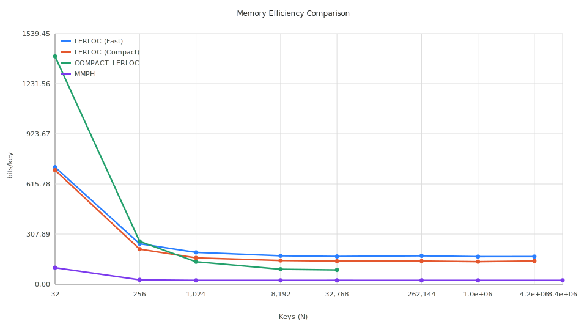
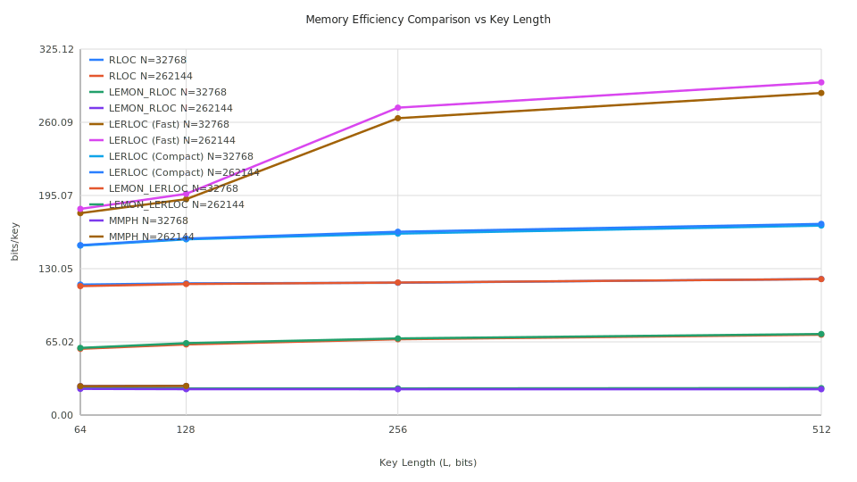
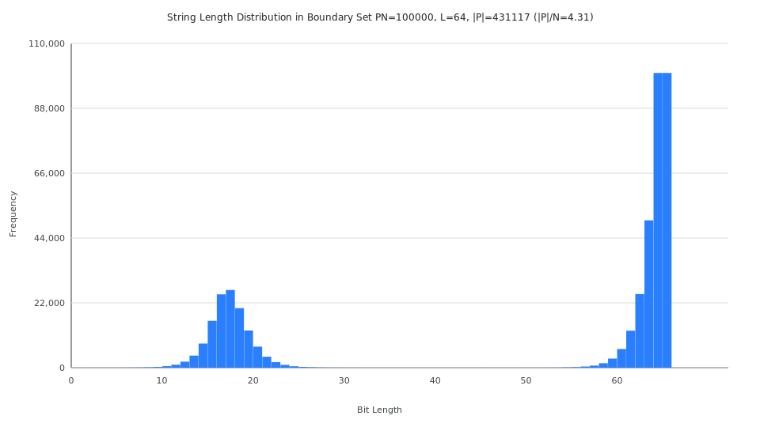

# Locators Module

The `locators` package provides structures for mapping query prefixes to rank intervals $[start, end)$ in a sorted key set. It serves as the bridge between tree-based navigation and index-based data retrieval.

## Sub-modules

- **`locators/rloc`**: Implements the base **Range Locator**. It indexes a boundary set $P$ derived from a trie and uses a Monotone Minimal Perfect Hash (MMPH) to map node names to intervals in $O(1)$ time.
- **`locators/lemon_rloc`**: Optimized Range Locator using **LeMonHash** (Learned Monotone MPH). Reduces boundary set overhead by ~60% compared to classical bucketing.
- **`locators/lerloc`**: Implements the **Local Exact Range Locator** (LERLOC). It composes a top-level trie (HZFT) with a Range Locator to support efficient prefix search without storing full keys.
- **`locators/lemon_lerloc`**: The most space-efficient variant, combining a **Succinct HZFT** with a **LeMon Range Locator**.

## Features

- **Trie Modes**: Supports multiple top-level trie and locator combinations:
  - `FastTrie` (Standard HZFT): Optimized for maximum query speed (~180 bits/key for $L=64$).
  - `CompactTrie` (Succinct SHZFT): Optimized for space using $O(N \log \log L)$ scaling (~150 bits/key for $L=64$).
  - `LeMon` (Learned): Uses learned indexes to achieve the best density (~60 bits/key for $L=64$).
- **Hierarchical Memory Reporting**: All structures implement `MemDetailed()`, providing a recursive breakdown of memory usage (Headers, MPH, Buckets, BitVectors) exportable to JSON.
- **Automated Parameter Selection**: Built-in logic to choose optimal bit-widths for internal types based on dataset size and key length.

## Performance Summary (64-bit keys)

### 1. Memory Efficiency (bits/key)

| Keys (N) | RLOC (Base) | RLOC (LeMon) | LERLOC (Fast) | LERLOC (Compact) | LERLOC (LeMon) |
|----------|-------------|--------------|---------------|------------------|----------------|
| 1,024    | 116.3       | 49.6         | 204.4         | 170.6            | 104.1          |
| 32,768   | 115.9       | 24.2         | 181.5         | 152.1            | 58.9           |
| 262,144  | 114.6       | 23.2         | 185.1         | 152.9            | 59.7           |

*Note: LeMon variants significantly reduce total memory by using learned monotone minimal perfect hashing.*


*Figure 1: Memory efficiency comparison across different modules and modes (L=64).*


*Figure 2: Scaling of memory efficiency with key length L (N=262,144).*

## Boundary Set (P) Distribution

The Range Locator indexes a boundary set $P$ derived from the trie. For $N$ keys of length $L$, the size of $P$ is typically $|P| \approx 4.3N$. The strings in $P$ are not all of length $L$; they follow a specific distribution based on the trie structure:


*Figure 2: Distribution of bit-lengths in P for N=100,000, L=64. Peaks at L and L+1 correspond to leaf-related boundaries.*

## Deep Dive Investigations

For detailed analysis of component scaling and memory bottlenecks, see:
- [MMPH & Boundary Set Expansion ($|P|/N \approx 3.3$)](rloc/MEMORY_INVESTIGATION.md)
- [HZFT Algorithm & Pseudo-descriptor Overhead ($O(N \log L)$)](rloc/HZFT_MEMORY_INVESTIGATION.md)
- [SHZFT Design & Succinct Dictionary Research ($O(N \log \log L)$)](rloc/OPTIMIZATION_3_RESEARCH.md)

## Benchmarking

To run the full suite including detailed memory breakdowns:

```bash
python3 locators/benchmarks/analyze.py --run --count 1 --bench BenchmarkMemoryDetailed
```

Plots and CSV reports will be generated in `locators/benchmarks/plots/` and `locators/benchmarks/parsed/`.
