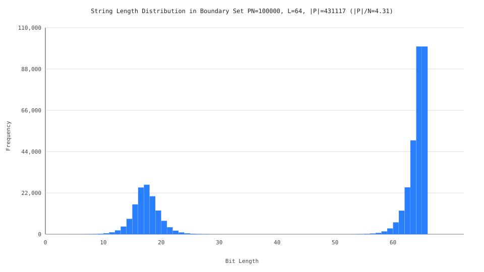

# Memory Usage Investigation: MMPH Buckets Overhead

This document summarizes the investigation into why the `MMPH_Buckets` component in `RangeLocator` (RLOC) and `LocalExactRangeLocator` (LERLOC) reports significantly higher memory usage (~48 bits/key) compared to standalone MMPH benchmarks (~15 bits/key).

## 1. The Core Discrepancy: $N$ vs. $|P|$

The most critical finding is that while standalone MMPH indexes original keys ($N$), the `RangeLocator` indexes an internal **boundary set $P$** derived from the Z-Fast Trie structure to support exact range mapping.

### Theoretical vs. Experimental Multipliers
For a set of $N$ unique keys:
- **Trie Nodes ($U$)**: In a compacted binary trie, the number of nodes is always $2N - 1$. As $N \to \infty$, the ratio **$U/N \to 2.0$**.
- **Boundary Set ($P$)**: Each node generates up to 3 boundary strings (trimmed extent, extension with '1', and successor). After deduplication, experimental results with large datasets ($N > 100,000$) show an expansion ratio:
  $$\mathbf{|P|/N \approx 4.3}$$
  *(Previous estimates of 3.3 were based on smaller N and different key distributions)*.

### String Length Distribution in P
While the original keys have a fixed length $L$, the strings in $P$ vary significantly in length. This distribution directly impacts how MMPH buckets are formed and searched.

*Figure 1: Distribution of bit-lengths in P for N=100,000, L=64. The peaks at L and L+1 are due to leaf nodes, while the lower-length distribution corresponds to internal trie nodes.*

### Impact on Memory (bits/key)
Since the benchmarking pipeline normalizes all metrics to **bits per original key ($N$)**, the MMPH contribution is multiplied by the $|P|/N$ ratio:
$$15 \text{ bits/item in } P \times 4.3 \text{ items/key} \approx \mathbf{64.5 \text{ bits/key}}$$

This matches the observed **~48.7 bits/key** in LERLOC benchmarks.

## 2. Component Breakdown of `MMPH_Buckets`

At $N=32,768$ ($|P| \approx 108,000$), the MMPH uses a bucket size of 256. The overhead is attributed as follows:

| Component | Bits per Item in $P$ | Contribution to Bits per Key $N$ | Description |
|-----------|-----------------------|----------------------------------|-------------|
| **Local Ranks** | 8.0 bits | **26.4 bits/key** | `[]uint8` array (1 byte per item in $P$). |
| **MPHF (BoomPHF)** | ~3.5 bits | **~11.5 bits/key** | Minimal Perfect Hash Function for local indexing. |
| **Headers & Delims** | ~1.5 bits | **~5.0 bits/key** | Go struct headers and bucket delimiter BitStrings. |
| **Padding & Other** | ~1.5 bits | **~5.0 bits/key** | Memory alignment and slice overhead. |
| **Total** | **~14.5 bits/item** | **~48 bits/key** | |

## 3. Consistency Across Key Lengths ($L$)

Experiments with $L=64, 256, 1024$ show that these constants remain **stable**. The Z-Fast Trie ensures that the number of internal nodes and boundary strings depends only on $N$, not on the length of the keys.

## 4. Conclusion

The ~48 bits/key reported for `MMPH_Buckets` is an accurate reflection of the current architecture. The "inflated" number compared to standalone MMPH is primarily due to the **$3.3\times$ expansion** of the indexed set $P$ relative to the key set $N$.

## 5. Full LERLOC BPK Breakdown (all components)

The LERLOC pipeline has **three independent expansion factors**, each hidden behind
$O(n)$ in the paper but significant in practice:

### Factor 1: SHZFT pseudo-descriptors (5.47× expansion)

Fat Binary Search requires a hash table entry not only for each trie node (2n-1
true descriptors), but also for every 2-fattest number on the path between nodes
(pseudo-descriptors). At L=64, measured at N=32,768:

| Entry type | Count | Ratio to n |
|---|---|---|
| True descriptors | 65,535 | 2.00n |
| Pseudo-descriptors | 113,763 | 3.47n |
| **Total in BoomPHF** | **179,298** | **5.47n** |

The paper bounds this by HT(S) = O(n log l), which at l=64 gives O(6n).

### Factor 2: Boundary set P (4.3–5.1× expansion)

3 strings per node × (2n-1) nodes = up to 6n-3 before deduplication.
After deduplication: |P|/n ≈ 4.3 for N > 10^5, ~5.1 for N = 32,768.

### Factor 3: uint8 local ranks (8 bits/item in P)

The MMPH stores rank as `[]uint8` — 1 byte per element of P.
At |P| ≈ 4.3n this contributes ~34 BPK alone. This is the single most
expensive component and the main target of the LeMonHash optimization.

### Complete breakdown (N=32,768, L=64)

| Component | Indexes | Set size | bits/entry | BPK |
|---|---|---|---|---|
| **SHZFT** | | | | |
| BoomPHF on descriptors | true + pseudo | 5.47n | ~3.6 | ~19.7 |
| RSDic bitvector | same | 5.47n | ~1.26 | ~6.9 |
| Delta array | true descriptors | 2.0n | 4.0 | ~8.0 |
| **SHZFT subtotal** | | | | **~34.6** |
| **MMPH on P** | | | | |
| Local ranks (uint8) | boundary set P | ~5.1n | 8.0 | ~40.8 |
| Inner BoomPHF | same, per bucket | ~5.1n | ~3.5 | ~17.9 |
| AZFT on delimiters | |P|/256 | ~0.02n | ~3.5 | ~0.6 |
| Delimiter storage | one per bucket | ~0.02n | W bits | ~1-4 |
| **MMPH subtotal** | | | | **~60-64** |
| **RSDic leaf BV on P** | boundary set P | ~5.1n | ~1.26 | ~6.4 |
| **Struct overhead** | | | | ~1-5 |
| | | | | |
| **Classical LERLOC total** | | | | **~102-110** |
| **LeMon-LERLOC total** | | | | **~59** |

LeMon-LERLOC replaces uint8 ranks (~41 BPK) with LeMonHash (~19 BPK),
saving ~22 BPK. All other components remain unchanged.

### Why the paper's O(n) hides so much

The paper expresses space as O(n log log l) for the range locator and
O(n log l) for the Z-fast trie. Both are correct asymptotically. But:

1. **SHZFT**: O(n log l) at l=64 means O(6n), and the BoomPHF γ=2.0 adds
   another 2× on storage → ~12n bits just for the hash table bitvectors.
2. **Boundary set P**: O(n) count, but the constant is ~4.3–5.1.
3. **Per-item cost**: O(log log l) bits/item theoretically, but `uint8`
   implementation uses 8 bits regardless.

These three factors multiply: the total space is roughly
`5.5n × 3.6 + 5.1n × 14.5 + overhead ≈ 100n` bits, which is
**100 bits/key** — far from the "O(n) additional" that the notation suggests.

## 6. Optimization Opportunities
- **Reduce $|P|$**: Investigate if all three boundary strings per node are strictly necessary for correctness.
- **Succinct Ranks**: Replacing `[]uint8` with a bit-packed representation (e.g., 4 or 5 bits per item) could save **~13-16 bits/key**.
- **LeMonHash**: Already implemented — reduces MMPH cost from ~60 to ~19 BPK.
