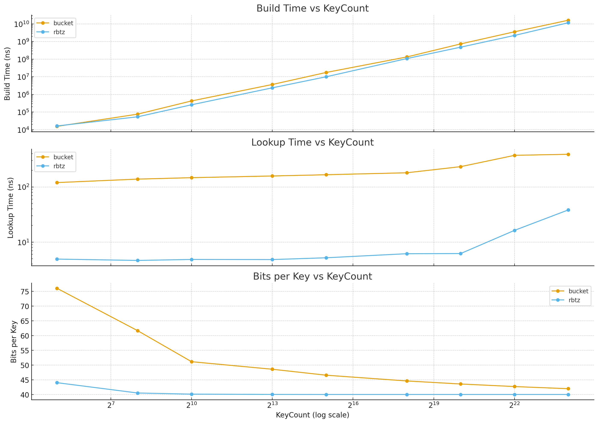

# Отчет: Monotone Minimal Perfect Hashing (MMPH)

## 1. Обзор проблемы

**Monotone Minimal Perfect Hash Function (MMPH)** — это функция $h$, которая отображает набор из $n$ ключей $S$ в диапазон целых
чисел $[0, n-1]$ так, что сохраняется лексикографический порядок ключей.

Если $key_1 < key_2$, то $h(key_1) < h(key_2)$. По сути, это функция, возвращающая ранг (порядковый номер) ключа в отсортированном множестве
за константное время.

### Текущее состояние в Go

На данный момент в экосистеме Go отсутствуют готовые библиотеки, реализующие алгоритмы сжатия MMPH. Существующие библиотеки (например,
`alecthomas/mph`) реализуют обычное минимальное идеальное хеширование (MPH), которое не сохраняет порядок.

## 2. Теоретические методы (на основе статьи 2009 г.)

Согласно документу [«Monotone Minimal Perfect Hashing»](https://vigna.di.unimi.it/ftp/papers/MonotoneMinimalPerfectHashing.pdf), существуют
два основных теоретических подхода, оптимизирующих потребление памяти. Здесь $n$ — количество ключей, $w$ — длина машинного слова (например,
64 бита).

### Метод А: Bucketing with LCP (Скорость)

see [bucket-mmph](bucket-mmph)

Использует сегментирование на основе наибольших общих префиксов.

- **Время запроса**: $O(1)$
- **Память**: $O(n \log w)$ бит
- **Особенность**: Самый быстрый метод из классических, но потребляет больше памяти, чем вариант с Trie

### Метод Б: Hash Displace and Compress (MMPH)

see [rbtz-mmph](rbtz-mmph/)

Использует двухуровневое хеширование с размещением и сжатием, описанное в
статье [Hash, displace, and compress](https://cmph.sourceforge.net/papers/esa09.pdf). Поскольку единственные издержки - хранение индексов,
алгоритм получается довольно оптимальным, на уровне LCP Bucketing.

- **Время запроса**: $O(1)$
- **Память**: $O(n \log n)$ бит (два массива uint32)
- **Особенность**: Эффективная реализация MMPH, сохраняет порядок благодаря хранению оригинальных индексов

### Метод В: Probabilistic Trie (Сжатие)

Использует вероятностные деревья (z-fast trie) и относительное ранжирование.

- **Время запроса**: $O(\log w)$ (не зависит от $n$, только от разрядности ключа)
- **Память**: $O(n \log \log w)$ бит
- **Особенность**: Экстремально компактное хранение (теоретически 2-3 бита на ключ), но сложная реализация

## 3. Современные подходы (State-of-the-Art)

### LeMonHash (Learned Monotone Minimal Perfect Hashing)

Современный метод (представлен в 2023 году), использующий концепцию Learned Indexes вместо классических структур данных.

**Принцип работы**: Использует PGM-index (Piecewise Geometric Model) для построения кусочно-линейной функции, аппроксимирующей график
зависимости ключа от его ранга. Коллизии и неточности предсказания разрешаются с помощью вспомогательной структуры BuRR.

**Преимущества**:

- **Компактность**: Достигает потребления памяти 1.3 – 3 бита на ключ, что часто превосходит теоретические методы на основе Trie
- **Скорость**: Благодаря "плоской" структуре (вычисления вместо переходов по указателям) обеспечивает высокую скорость чтения, удобную для
  префетчинга CPU

**Статус**: Существует эталонная реализация на C++ ([GitHub: ByteHamster/LeMonHash](https://github.com/ByteHamster/LeMonHash)). Портов на Go
пока нет.

## 4. Сравнительный анализ асимптотик

Ниже приведено сравнение теоретических методов, современных подходов и стандартного Workaround'а.

| Метод                                  | Время запроса (Query)  | Потребление памяти (Space) |
|----------------------------------------|------------------------|----------------------------|
| MMPH: LCP Bucketing                    | $O(1)$                 | $O(n \log w)$              |
| MMPH: Hash Displace and Compress (hdc) | $O(1)$                 | $O(n \log n)$              |
| MMPH: Relative Trie                    | $O(\log w)$            | $O(n \log \log w)$         |
| LeMonHash (Learned)                    | Быстро (Math + Lookup) | $? O(n) но как ? $         |

**Примечание**: $n$ — кол-во ключей, $w$ — длина ключа в битах (обычно 64).

## 5. Экспериментальное сравнение

# 📊 Сравнение MPH Структур: `hdc-rbtz` vs `lcp-bucketing`

## 🏗 Build Time (ns)

| Keys       | rbtz           | bucket         |
|------------|----------------|----------------|
| 32         | 16,338         | 15,424         |
| 256        | 53,985         | 76,537         |
| 1,024      | 259,469        | 428,988        |
| 8,192      | 2,371,186      | 3,671,151      |
| 32,768     | 10,038,608     | 17,648,310     |
| 262,144    | 108,401,879    | 134,163,823    |
| 1,048,576  | 480,714,931    | 737,158,792    |
| 4,194,304  | 2,220,704,042  | 3,582,287,916  |
| 16,777,216 | 11,705,159,417 | 16,250,687,375 |

## 🧠 Bits per Key (in memory)

| Keys       | rbtz  | bucket |
|------------|-------|--------|
| 32         | 44.00 | 76.00  |
| 256        | 40.50 | 61.62  |
| 1,024      | 40.12 | 51.12  |
| 8,192      | 40.02 | 48.56  |
| 32,768     | 40.00 | 46.54  |
| 262,144    | 40.00 | 44.59  |
| 1,048,576  | 40.00 | 43.56  |
| 4,194,304  | 40.00 | 42.69  |
| 16,777,216 | 40.00 | 41.96  |

## ⚡ Lookup Time (ns)

| Keys       | rbtz  | bucket |
|------------|-------|--------|
| 32         | 4.918 | 120.0  |
| 256        | 4.651 | 138.7  |
| 1,024      | 4.845 | 147.2  |
| 8,192      | 4.823 | 158.0  |
| 32,768     | 5.197 | 166.5  |
| 262,144    | 6.158 | 180.7  |
| 1,048,576  | 6.204 | 233.3  |
| 4,194,304  | 16.32 | 374.0  |
| 16,777,216 | 38.33 | 391.3  |

## Вывод:

Пока что у меня не получилось нормально реализовать Bucketing, там много накладных расходов

## Литература

- [Monotone Minimal Perfect Hashing: Searching a Sorted Table with O(1) Accesses](https://vigna.di.unimi.it/ftp/papers/MonotoneMinimalPerfectHashing.pdf) -
  Belazzougui D., Boldi P., Pagh R., Vigna S.
- [Hash, displace, and compress](https://cmph.sourceforge.net/papers/esa09.pdf)
- [LeMonHash: Learned Monotone Minimal Perfect Hashing](https://github.com/ByteHamster/LeMonHash) - GitHub Repository
