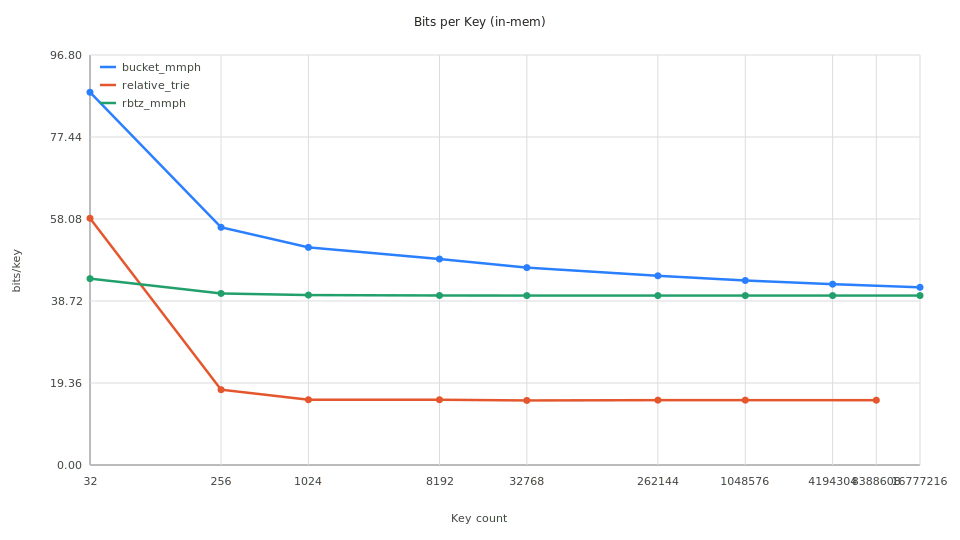
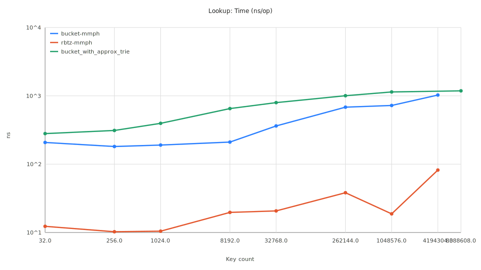
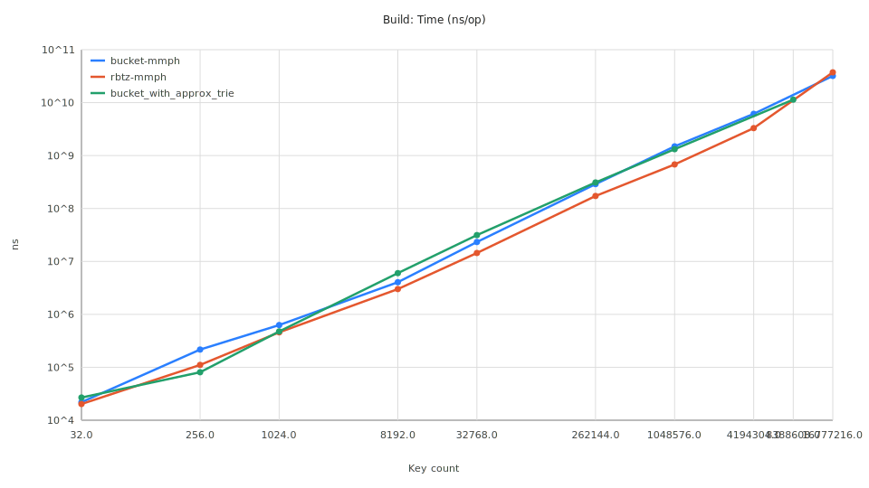
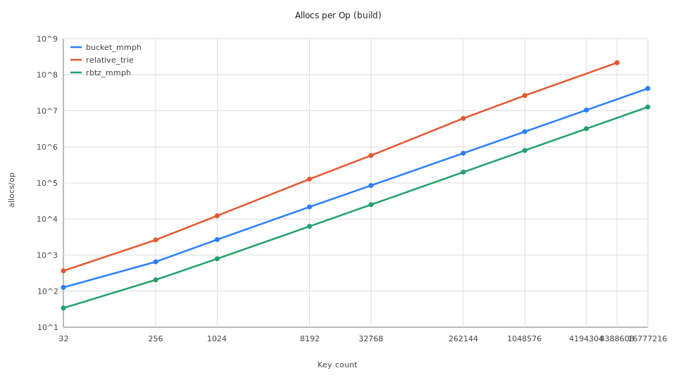

# Report: Monotone Minimal Perfect Hashing (MMPH)

## 1. Problem overview

**Monotone Minimal Perfect Hash Function (MMPH)** is a function $h$ that maps a set of $n$ keys $S$ into the integer
range
$[0, n-1]$ while preserving lexicographic order.

If $key_1 < key_2$, then $h(key_1) < h(key_2)$. In essence, it returns the rank (order index) of a key in the sorted set
in constant time.

### Current state in Go

At the moment, the Go ecosystem has no ready libraries implementing compressed MMPH algorithms. Existing libraries (e.g.
`alecthomas/mph`) implement standard minimal perfect hashing (MPH) and do not preserve order.

## 2. API

The structure provides a minimalistic interface:

### `Build(sorted_keys)`

Builds an index over the given set of unique sorted keys.

- **Input**: Array of keys (static sorted list)
- **Complexity**: $O(n \log w)$

### `Rank(key) -> int`

Returns the order index (rank) of a key in the original set.

- **Input**: Key $x$
- **Output**: Integer $i \in [0, n-1]$
- **Complexity**: $O(1)$ for LCP Bucketing, $O(\log w)$ for Probabilistic Trie

**Important**: If $key \notin S$, the result is undefined. Membership validation must be done externally (e.g., Bloom
Filter).

## 3. Theoretical methods (based on the 2009 paper)

According
to ["Monotone Minimal Perfect Hashing"](https://vigna.di.unimi.it/ftp/papers/MonotoneMinimalPerfectHashing.pdf),
there are two main theoretical approaches that optimize memory usage. Here $n$ is the number of keys, $w$ is the machine
word size (e.g., 64 bits).

### Method A: Bucketing with LCP (Speed)

see [bucket-mmph](bucket-mmph)

Uses segmentation based on longest common prefixes.

- **Query time**: $O(1)$
- **Space**: $O(n \log w)$ bits
- **Notes**: Fastest of the classic methods, but uses more memory than the trie variant

### Method B: Hash Displace and Compress (MMPH)

see [rbtz-mmph](rbtz-mmph/)

Uses two-level hashing with displacement and compression, as described in
[Hash, displace, and compress](https://cmph.sourceforge.net/papers/esa09.pdf). Since the main cost is storing indices,
this approach is quite efficient, at the LCP-bucketing level.

- **Query time**: $O(1)$
- **Space**: $O(n \log n)$ bits (two uint32 arrays)
- **Notes**: Efficient MMPH implementation, preserves order by storing original indices

### Method C: Probabilistic Trie (Compression)

Uses probabilistic trees (z-fast trie) and relative ranking.

- **Query time**: $O(\log w)$ (independent of $n$, only key bit-width)
- **Space**: $O(n \log \log w)$ bits
- **Notes**: Extremely compact (theoretically 2-3 bits/key), but harder to implement
- **In this repo**: prototype `bucket_with_approx_trie/` with an approximate z-fast trie and full-key validation;
  details and plots in `bucket_with_approx_trie/analysis_summary.md` and the collision-filter note
  `zfasttrie/getexistingprefix_collision_filter.md`.

## 3. Modern approaches (State-of-the-Art)

### LeMonHash (Learned Monotone Minimal Perfect Hashing)

A modern method (introduced in 2023) using learned indexes instead of classical data structures.

**Idea**: Uses a PGM-index (Piecewise Geometric Model) to build a piecewise-linear function approximating the
key-to-rank
mapping. Collisions and prediction errors are resolved via an auxiliary BuRR structure.

**Pros**:

- **Compact**: 1.3 - 3 bits per key, often beating trie-based theoretical methods
- **Fast**: "Flat" structure (math instead of pointer chasing) gives strong read performance and CPU prefetch behavior

**Status**: Reference C++ implementation
exists ([GitHub: ByteHamster/LeMonHash](https://github.com/ByteHamster/LeMonHash)).
No Go ports yet.

## 4. Asymptotic comparison

Below is a comparison of theoretical methods, modern approaches, and a standard workaround.

| Method                                 | Query time           | Space                          |
|----------------------------------------|----------------------|--------------------------------|
| MMPH: LCP Bucketing                    | $O(1)$               | $O(n \log w)$                  |
| MMPH: Hash Displace and Compress (hdc) | $O(1)$               | $O(n \log n)$                  |
| MMPH: Relative Trie                    | $O(\log w)$          | $O(n \log \log w)$             |
| MMPH: Relative Trie (impl)             | $O(\log w)$          | $O(n \log \log w)$ + constants |
| LeMonHash (Learned)                    | Fast (Math + Lookup) | $? O(n) but how ? $            |

**Note**: $n$ is the number of keys, $w$ is key length in bits (typically 64).

## 5. Application

In the Range Filter architecture (Approximate Range Emptiness), MMPH is used as a low-level building block to speed up
navigation.

### Usage hierarchy

```
Approximate Range Emptiness (Top level)
            ↓
Local Exact Range Structure (Compressed key storage)
            ↓
Weak Prefix Search (Find node in implicit prefix tree)
            ↓
Range Locator (Map tree node to index interval)
            ↓
MMPH (Compute range boundaries in O(1))
```

MMPH replaces binary search ($O(\log n)$) with constant-time address computation, which is critical for overall filter
performance.

## 6. Experimental comparison (bench pipeline)

Benchmarks are collected via `benchmarks/analyze.py --run` using `go test -bench=. -benchmem -count=5` for each module.
Results are parsed and normalized by `benchmarks/analyze.py`. Note that key distributions differ across modules
(as-implemented), so comparisons reflect current implementations rather than a unified key generator.

### Performance Summary (Bits per Key)

| Key Count  | bucket-mmph | bucket_with_approx_trie | rbtz-mmph |
|------------|-------------|-------------------------|-----------|
| 32         | 88.00       | 58.25                   | 44.00     |
| 1,024      | 51.38       | 15.41                   | 40.12     |
| 32,768     | 46.60       | 15.24                   | 40.00     |
| 1,048,576  | 43.56       | 15.31                   | 40.00     |
| 16,777,216 | 41.95       | -                       | 40.00     |

### Visualizations

#### 1. Space Efficiency (Memory)


*Figure 1: `bucket_with_approx_trie` is significantly more compact (~15 bits/key) compared to classical bucketing (~
40-42 bits/key).*

#### 2. Query Performance


*Figure 2: `bucket-mmph` and `rbtz-mmph` provide $O(1)$ lookup. `bucket_with_approx_trie` is $O(\log w)$ but remains
competitive at small-to-medium scales.*

#### 3. Build Scalability


*Figure 3: Build time scaling across implementations. `bucket-mmph` shows higher allocation overhead.*

#### 4. Allocation Overhead


*Figure 4: `bucket-mmph` performs significantly more allocations during build than `rbtz-mmph`.*

### Analysis

1. **Memory King**: `bucket_with_approx_trie` lives up to its theoretical promise, achieving ~15 bits per key, which is
   2.6x better than `rbtz-mmph`.
2. **Stability**: `rbtz-mmph` is remarkably stable at exactly 40 bits per key (using two `uint32` arrays) for large $n$.
3. **Build Cost**: `bucket-mmph` is currently the most "expensive" to build in terms of memory allocations, suggesting
   optimization potential in its bucket management logic.

## Addendum: `bucket_with_approx_trie` (Relative Trie)

For the probabilistic-trie approach, there is a separate study with build-success plots and theoretical curves.
See `bucket_with_approx_trie/analysis_summary.md` and the overlays:

- `bucket_with_approx_trie/study/plots/s8_success_vs_n_overlay.svg`
- `bucket_with_approx_trie/study/plots/s16_success_vs_n_overlay.svg`

A key difference from the paper: the implementation includes a length-consistency filter for MPH false hits
(`zfasttrie/getexistingprefix_collision_filter.md`), which makes empirical success rates notably higher than the
pessimistic theoretical bounds.

## References

- [Monotone Minimal Perfect Hashing: Searching a Sorted Table with O(1) Accesses](https://vigna.di.unimi.it/ftp/papers/MonotoneMinimalPerfectHashing.pdf) -
  Belazzougui D., Boldi P., Pagh R., Vigna S.
- [Hash, displace, and compress](https://cmph.sourceforge.net/papers/esa09.pdf)
- [LeMonHash: Learned Monotone Minimal Perfect Hashing](https://github.com/ByteHamster/LeMonHash) - GitHub repository
- [Fast Prefix Search in Little Space, with Applications](https://arxiv.org/abs/1804.04720) - Belazzougui D., Boldi P.,
  Pagh R., Vigna S.
- [Approximate Range Emptiness in Constant Time and Optimal Space](https://arxiv.org/pdf/1407.2907) - Goswami M.,
  Gronlund A., Larsen K. G., Pagh R.
