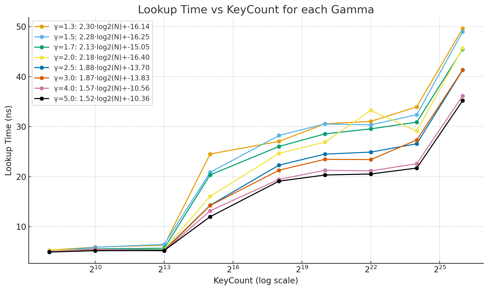
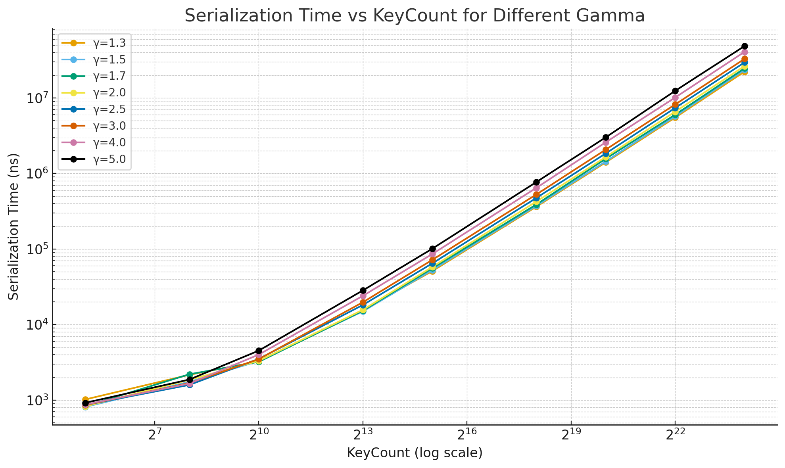

### Build Time (ns) by Gamma and Key Count

| KeyCount |         1.3 |         1.5 |         1.7 |         2.0 |         2.5 |         3.0 |         4.0 |         5.0 |
|---------:|------------:|------------:|------------:|------------:|------------:|------------:|------------:|------------:|
|      256 |        2696 |        2669 |        2240 |        2157 |        2068 |        2105 |        1767 |        1707 |
|     1024 |       10084 |        9371 |        8025 |        7704 |        7212 |        7255 |        5868 |        5679 |
|     8192 |       76343 |       69927 |       65795 |       59867 |       55761 |       53303 |       47855 |       46241 |
|    32768 |      448942 |      389833 |      353512 |      269426 |      238474 |      220470 |      212790 |      202738 |
|   262144 | 7.71566e+06 | 6.78731e+06 | 5.94285e+06 | 5.07974e+06 | 4.08165e+06 | 3.46147e+06 | 2.79988e+06 | 2.57998e+06 |
|  1048576 | 3.35498e+07 | 3.05554e+07 | 2.78848e+07 | 2.39283e+07 | 1.95185e+07 | 1.68571e+07 | 1.35653e+07 | 1.17453e+07 |
|  4194304 | 1.48118e+08 | 1.33105e+08 | 1.16686e+08 | 1.05888e+08 | 8.30568e+07 | 7.24187e+07 | 5.64868e+07 | 5.13352e+07 |
| 16777216 | 5.98825e+08 |  5.5102e+08 | 4.78771e+08 | 4.13989e+08 | 3.50023e+08 | 3.02236e+08 | 2.68675e+08 | 3.07873e+08 |
| 67108864 | 3.06743e+09 | 2.94812e+09 | 2.79285e+09 | 2.39359e+09 | 2.13932e+09 | 2.19473e+09 | 2.09494e+09 | 1.88214e+09 |

### Build Time per Key (ns) by Gamma and Key Count

| KeyCount |    1.3 |    1.5 |    1.7 |    2.0 |    2.5 |    3.0 |    4.0 |    5.0 |
|---------:|-------:|-------:|-------:|-------:|-------:|-------:|-------:|-------:|
|      256 | 10.531 | 10.426 |   8.75 |  8.426 |  8.078 |  8.223 |  6.902 |  6.668 |
|     1024 |  9.848 |  9.151 |  7.837 |  7.523 |  7.043 |  7.085 |   5.73 |  5.546 |
|     8192 |  9.319 |  8.536 |  8.032 |  7.308 |  6.807 |  6.507 |  5.842 |  5.645 |
|    32768 | 13.701 | 11.897 | 10.788 |  8.222 |  7.278 |  6.728 |  6.494 |  6.187 |
|   262144 | 29.433 | 25.892 |  22.67 | 19.378 |  15.57 | 13.204 | 10.681 |  9.842 |
|  1048576 | 31.996 |  29.14 | 26.593 |  22.82 | 18.614 | 16.076 | 12.937 | 11.201 |
|  4194304 | 35.314 | 31.735 |  27.82 | 25.246 | 19.802 | 17.266 | 13.467 | 12.239 |
| 16777216 | 35.693 | 32.843 | 28.537 | 24.676 | 20.863 | 18.015 | 16.014 | 18.351 |
| 67108864 | 45.708 |  43.93 | 41.617 | 35.667 | 31.878 | 32.704 | 31.217 | 28.046 |

### Lookup Time (ns) by Gamma and Key Count

| KeyCount |   1.3 |   1.5 |   1.7 |   2.0 |   2.5 |   3.0 |   4.0 |   5.0 |
|---------:|------:|------:|------:|------:|------:|------:|------:|------:|
|      256 | 5.294 | 5.122 | 5.236 |  5.27 | 4.911 | 4.989 | 5.032 | 4.931 |
|     1024 | 5.917 | 5.879 | 5.558 | 5.452 | 5.467 | 5.277 | 5.482 | 5.198 |
|     8192 |  6.29 | 6.471 | 5.688 | 5.442 | 5.316 | 5.206 | 5.149 | 5.224 |
|    32768 | 24.53 | 20.86 | 20.35 | 16.05 | 14.27 | 14.22 | 13.18 | 11.99 |
|   262144 | 27.05 | 28.24 | 26.04 | 24.65 | 22.31 | 21.29 | 19.46 |  19.1 |
|  1048576 | 30.57 | 30.54 | 28.55 | 26.91 | 24.51 | 23.47 | 21.27 | 20.33 |
|  4194304 | 31.06 | 30.36 | 29.56 | 33.26 | 24.91 | 23.42 | 21.16 | 20.54 |
| 16777216 | 33.97 | 32.39 |  30.9 | 29.12 | 26.58 | 27.33 | 22.59 | 21.72 |
| 67108864 | 49.62 | 48.99 |  45.5 | 45.69 | 41.31 | 41.36 | 36.16 | 35.21 |

### Bits per Key by Gamma and Key Count

| KeyCount |   1.3 |   1.5 |   1.7 |   2.0 |   2.5 |   3.0 |   4.0 |   5.0 |
|---------:|------:|------:|------:|------:|------:|------:|------:|------:|
|      256 |   4.5 |  4.75 |     5 |  5.25 |     6 |  6.25 |  7.25 |  8.25 |
|     1024 | 3.938 | 3.875 | 3.875 | 4.125 | 4.812 | 5.125 |     6 | 7.312 |
|     8192 | 3.188 | 3.344 | 3.484 | 3.812 | 4.305 | 4.766 | 5.852 | 7.031 |
|    32768 |  3.17 | 3.307 | 3.463 | 3.719 | 4.227 | 4.732 | 5.801 | 6.906 |
|   262144 | 3.156 | 3.288 | 3.447 | 3.712 | 4.187 | 4.707 | 5.784 | 6.861 |
|  1048576 | 3.155 | 3.285 | 3.445 | 3.708 |  4.19 | 4.708 | 5.777 | 6.872 |
|  4194304 | 3.156 | 3.286 | 3.446 | 3.709 | 4.197 |  4.71 |  5.78 | 6.873 |
| 16777216 | 3.157 | 3.287 | 3.444 |  3.71 | 4.196 |  4.71 | 5.779 |  6.87 |
| 67108864 | 3.156 | 3.287 | 3.444 |  3.71 | 4.197 | 4.711 | 5.778 | 6.872 |

### Serialization time by Gamma and Key Count

|   KeyCount |     1.3  |     1.5  |     1.7  |     2.0  |     2.5  |     3.0  |     4.0  |     5.0  |
|-----------:|---------:|---------:|---------:|---------:|---------:|---------:|---------:|---------:|
|         32 |   1023.0 |    815.3 |    832.3 |    827.2 |    864.1 |    863.8 |    875.0 |    923.0 |
|        256 |   2167.0 |   1748.0 |   2204.0 |   1861.0 |   1593.0 |   1688.0 |   1658.0 |   1877.0 |
|       1024 |   3264.0 |   3296.0 |   3220.0 |   3317.0 |   3522.0 |   3495.0 |   4012.0 |   4530.0 |
|       8192 |  15645.0 |  14991.0 |  15279.0 |  15691.0 |  18202.0 |  19791.0 |  24061.0 |  28365.0 |
|      32768 |  51067.0 |  52766.0 |  55616.0 |  58009.0 |  64587.0 |  71888.0 |  85939.0 | 100986.0 |

