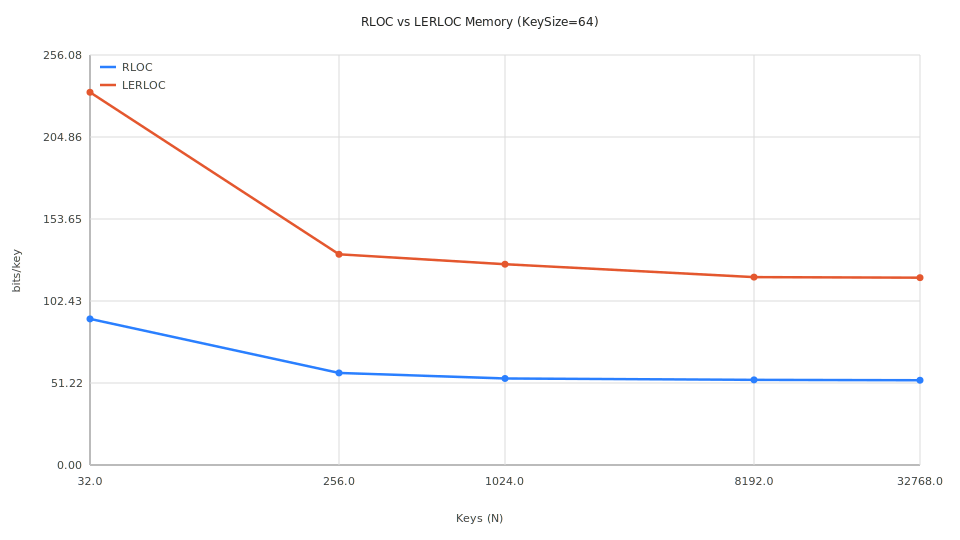
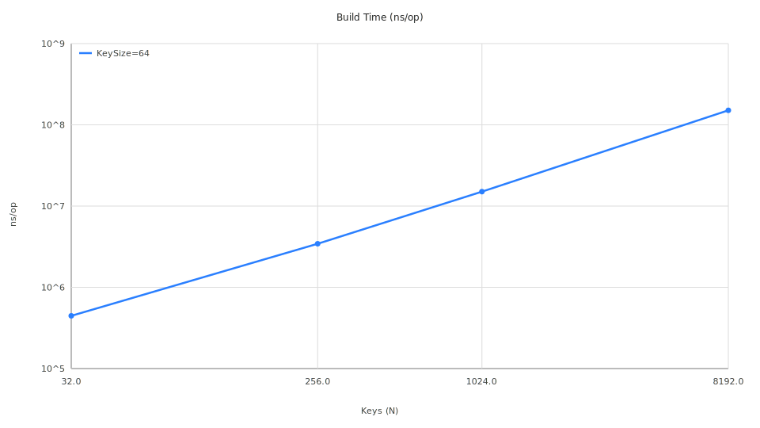

# Range Locator (RLOC)

This module implements the Range Locator structure, a critical building block for mapping tree nodes or prefix intervals to rank ranges $[start, end)$ in $O(1)$ time.

## Performance Summary

The following results are based on automated benchmarks for 64-bit keys.

### 1. Memory Efficiency (bits/key)

| Keys (N) | RLOC (bits/key) | LERLOC (bits/key) | Ratio (LERL/RL) |
|----------|-----------------|-------------------|-----------------|
| 32       | 91.25           | 232.8             | 2.54x           |
| 1,024    | 54.04           | 125.4             | 2.32x           |
| 32,768   | 52.94           | 117.0             | 2.21x           |


*Figure 1: Comparison of memory consumption between standard RLOC and Learned RLOC.*

### 2. Build Time Scaling

Build time increases linearly with the number of keys. For $N=32768$, construction takes approximately 1.1 seconds on an M4 Max.


*Figure 2: Construction time scaling (Log-Log scale).*

## Architecture

RLOC is used in the following hierarchy:
1. **Weak Prefix Search**: Find the representative node in a trie.
2. **Range Locator**: Map that node to an index interval in the sorted key array.

## Benchmarking

To reproduce these results or run new studies, use the automated pipeline:

```bash
pipenv run python3 rloc/benchmarks/analyze.py --run --count 5 --split
```

See `rloc/benchmarks/README.md` for more details on the benchmarking infrastructure.
