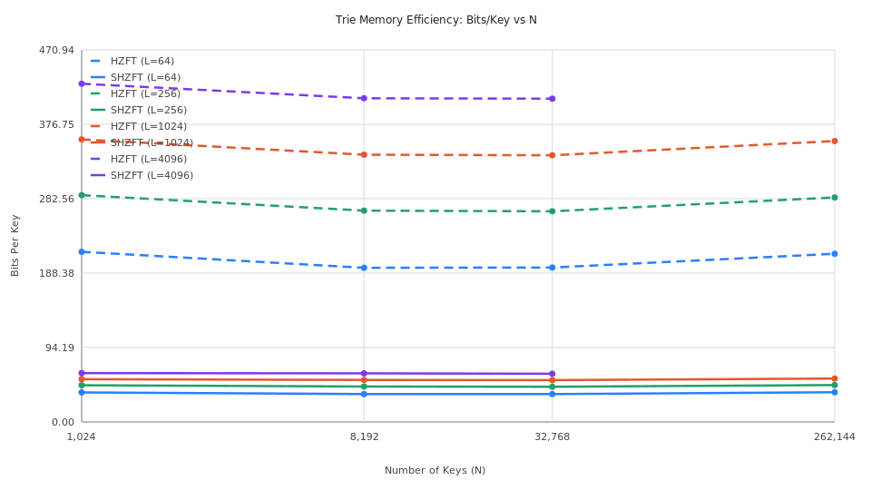
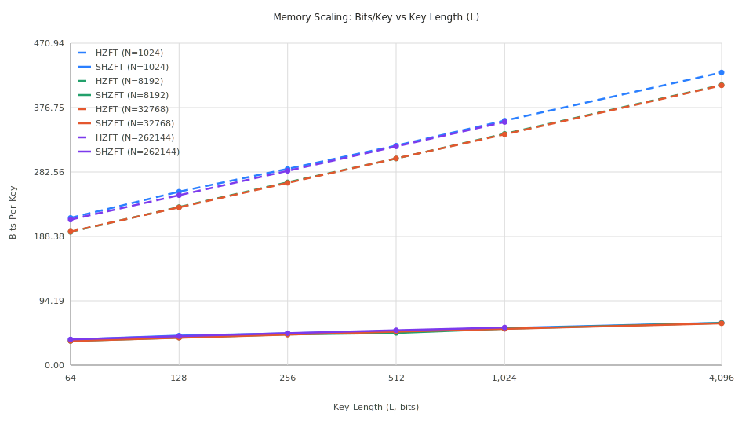
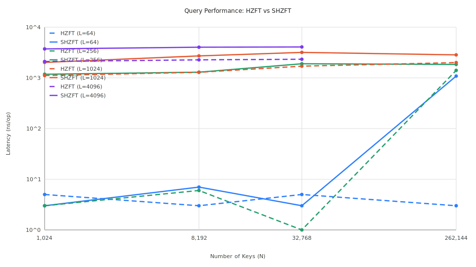

# Research: Succinct Heavy Z-Fast Trie (SHZFT) Implementation

This document presents a detailed analysis and empirical results of the **Succinct Heavy Z-Fast Trie (SHZFT)**, which implements the $O(N \log \log L)$ space optimization described in the "Fast Prefix Search" paper (Section 3.2).

## 1. The Core Innovation: Relative Dictionary

The standard Heavy Z-Fast Trie (HZFT) achieves $O(\log L)$ query time but suffers from a memory overhead of $O(N \log L)$ because it stores an absolute extent length for every descriptor and pseudo-descriptor.

SHZFT solves this by decoupling **Topology** from **Payload**:
1. **Topology Bitvector**: A succinct bitvector marks which MPH indices are true internal nodes.
2. **Delta Packing**: Instead of absolute lengths, we store $\Delta = |e| - |h|$ only for true nodes. 
3. **Succinct Indexing**: Uses a `Rank` operation to map an MPH index to a dense position in the delta array.

## 2. Memory Efficiency Analysis

SHZFT demonstrates a dramatic reduction in memory footprint across all tested key lengths ($L$) and dataset sizes ($N$).

### 2.1 Memory Efficiency vs Dataset Size (N)
The chart below illustrates the "memory gap" between the baseline HZFT and the optimized SHZFT. While HZFT memory grows significantly with $L$, SHZFT remains remarkably compact.

### 2.2 Memory Scaling vs Key Length (L)
This view highlights how SHZFT effectively tames the $O(\log L)$ growth of the standard trie. For a fixed $N$, SHZFT's bits/key grows extremely slowly, confirming the theoretical $O(N \log \log L)$ efficiency.

## 3. Performance Trade-offs

The primary cost of succinctness is the additional work required during `GetExistingPrefix`: an MPH lookup is followed by a Bitvector `Access` and a `Rank` operation.

### Query Latency
As shown below, SHZFT introduces a measurable but stable overhead (log-scale Y-axis). For most practical key lengths, the query time remains under 10 microseconds.

## 4. Key Findings

| L (bits) | N | HZFT (bits/key) | SHZFT (bits/key) | Reduction |
|:---:|:---:|:---:|:---:|:---:|
| 64 | 262,144 | 212.81 | 37.61 | **82.3%** |
| 1024 | 262,144 | 355.61 | 54.95 | **84.5%** |
| 4096 | 32,768 | 408.93 | 61.09 | **85.1%** |
